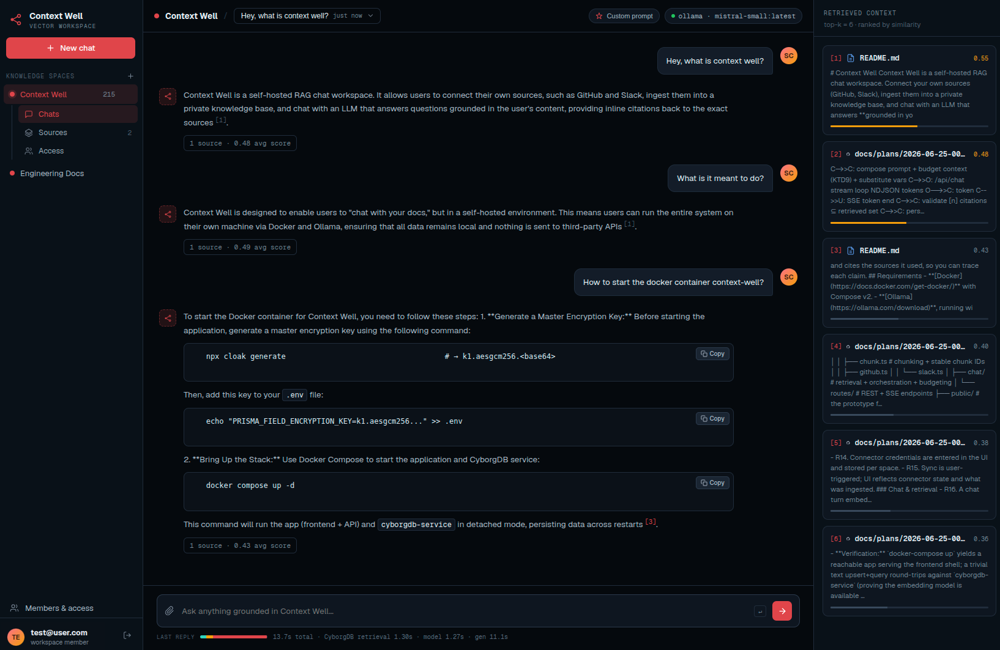

# Context Well

Context Well is a self-hosted RAG chat workspace. Connect your own sources
(GitHub, Slack), ingest them into a private knowledge base, and chat with an LLM
that answers **grounded in your content** — with inline citations back to the
exact sources. It's "chat with your docs," but one you run entirely yourself.

- **Fully local.** The app, the vector database, and the LLM all run on your own
  machine via Docker and [Ollama](https://ollama.com/). Nothing is sent to a
  third-party API — your data never leaves your infrastructure.
- **Encrypted at rest.** Chat content, connector credentials, and the per-space
  vector-index keys are encrypted with AES-256-GCM, and
  [CyborgDB](https://www.cyborg.co/) stores the embeddings themselves encrypted.
  A stolen disk or database dump is useless without your master key
  ([details](#security-encryption-at-rest)).
- **Grounded, cited answers.** Every response retrieves from your encrypted index
  and cites the sources it used, so you can trace each claim.



## Requirements

- **[Docker](https://docs.docker.com/get-docker/)** with Compose v2.
- **[Ollama](https://ollama.com/download)**, running with at least one chat model
  pulled:

```bash
ollama pull mistral-small      # or any chat model you prefer
```

## Setup

Context Well encrypts sensitive data at rest, so it needs one secret up front: a
master encryption key. It is deliberately never generated for you — a key sitting
on the same volume as the database it protects would defeat the purpose — so
create it once before the first start:

```bash
npx cloak generate                                    # → k1.aesgcm256.<base64>
echo "PRISMA_FIELD_ENCRYPTION_KEY=k1.aesgcm256..." >> .env
```

Then bring up the stack:

```bash
docker compose up -d
```

Open **http://localhost:3000** and finish setup in the UI:

1. Create the first admin account.
2. Connect Ollama — the URL is pre-filled (`http://host.docker.internal:11434`);
   click **Test connection** and pick your chat model.
3. Create a workspace and start adding context.

All data persists in named Docker volumes, so it survives restarts. To reach the
app from another machine on your LAN, use that host's IP instead of `localhost`
(e.g. `http://192.168.x.x:3000`).

## Configuration

`PRISMA_FIELD_ENCRYPTION_KEY` is the only required value. Everything else has a
working default; set any of these in `.env` to override (see `.env.example`):

- `SESSION_SECRET` — auto-generated and persisted if unset; pin it explicitly to
  share sessions across replicas.
- `OLLAMA_DEFAULT_URL` — pre-fills the setup wizard with a remote Ollama. The app
  rejects private IP literals (SSRF guard), so use a hostname.
- `PORT`, `COOKIE_SECURE` — see `.env.example`.

Each workspace's encrypted index holds up to 1 million embeddings, and no CyborgDB
API key is required.

## Local development (without Docker)

```bash
npm install
npx prisma migrate deploy
npm run dev                    # http://localhost:3000
```

Reads the same `.env`: set `PRISMA_FIELD_ENCRYPTION_KEY` and point `CYBORGDB_URL`
at a reachable `cyborgdb-service` (e.g. `http://localhost:8000`). Connect Ollama
from the setup UI as above.

## Security: encryption at rest

Context Well encrypts sensitive data at rest at the application layer, so a
stolen database file or disk snapshot is useless without the master key.

**Threat model.** Protects against an actor with a copy of the data — a lost
volume, a leaked backup, a raw `app.db` dump, or filesystem/cloud-provider
access. It does not defend against an attacker with live access to the running
process's memory (a server must decrypt to serve queries).

**What is encrypted** (AES-256-GCM via
[`prisma-field-encryption`](https://github.com/47ng/prisma-field-encryption)):
chat messages and cited snippets, connector credentials (GitHub/Slack tokens),
conversation/document titles, document metadata, space custom prompts, and —
critically — the per-space **CyborgDB index keys**, so the encrypted embeddings
can't be decrypted from a DB dump. Vector embeddings themselves are already
encrypted at rest by CyborgDB.

**The master key.** Set `PRISMA_FIELD_ENCRYPTION_KEY` (format
`k1.aesgcm256.<base64>`, via `npx cloak generate`). It is validated at boot and
is **required** — the app will not start without it. It is injected from the
environment and deliberately never generated onto or stored on the data volume.
**Back the key up** — losing it makes encrypted data unrecoverable.

**Rotation.** Set a new key in `PRISMA_FIELD_ENCRYPTION_KEY`, move the old key
into `PRISMA_FIELD_DECRYPTION_KEYS` (comma-separated) so existing data still
decrypts, then re-encrypt with `npx tsx scripts/backfill-encryption.ts`.

**Enabling on an existing database.** Deploy the new build, then run
`npx tsx scripts/backfill-encryption.ts` once to encrypt pre-existing rows. Order
doesn't matter: legacy plaintext rows are read through transparently until
re-encrypted.

**Residual (disk-encryption only).** `User.email` (a unique login-lookup key, so
it can't use randomized encryption) and `Session.id` (short-lived; the cookie is
already signed) are not app-encrypted. Run the deployment on an encrypted volume
to cover them.
