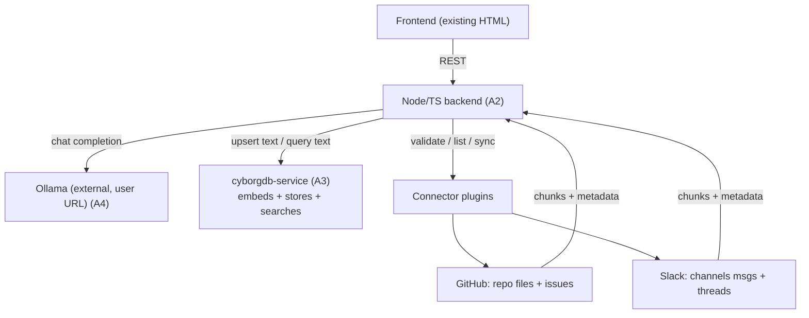

# knowledgeLLM — RAG Chat on CyborgDB (v1 requirements)

## Summary

Build a self-hosted, vector-grounded LLM chat workspace — the existing knowledgeLLM/Klavex frontend wired to a real backend. Users log in, connect their own Ollama, create knowledge spaces, connect GitHub and Slack to a space, ingest that content into a CyborgDB-backed index, and chat with answers grounded in retrieved sources shown as live `[n]` citations. It is AnythingLLM-shaped, but built on `cyborgdb-service` instead of LanceDB, with CyborgDB performing embedding server-side.

## Problem Frame

A working frontend prototype already demonstrates the product — chat with a retrieval sources rail, per-space corpora, connectors, agents, and RBAC — but it is entirely in-memory with a `window.claude` bridge and no backend. Nothing is real: no ingestion, no vector store, no LLM call. The team wants the same product running for real on its own encrypted vector database (`cyborgdb-service`) rather than the LanceDB that a tool like AnythingLLM would use. The prototype's full surface (agents, scheduler, full RBAC, four connectors) is too much to build at once; the immediate need is the core retrieval-grounded chat loop working end-to-end against two real sources.

## Key Decisions

- **CyborgDB embeds server-side; Ollama is chat-only.** Confirmed against `cyborgdb-js`: `upsert` accepts `contents` (text, no vector) and `query` accepts `queryContents` (text), and the service embeds via sentence-transformers. The embedding model is set per-index at creation via the optional `embeddingModel` parameter (e.g. `all-MiniLM-L6-v2` → 384d); the app chooses it, so it always knows the model and dimension, and `getDimension()` confirms the dimension. Ollama is used only for chat completion. The setup flow drops the embedding-model picker and keeps only the chat-model picker. The prototype's hardcoded `768d/1024d/1536d` labels are replaced by the index's actual model/dimension.
- **Node/TypeScript backend.** One language across the stack, matches the JS frontend and the `window.claude`-style bridge it already expects, and uses the `cyborgdb-js` SDK. The backend serves the existing HTML frontend and exposes the chat/ingest/connector API the frontend calls.
- **Connector plugin interface from day one.** GitHub and Slack are implemented against a small explicit connector contract (validate credentials, list targets, sync → chunks + metadata) rather than hardcoded, because more connectors are planned. A registry drives which connectors the UI offers.
- **Multi-user login, no role enforcement.** Real accounts and sessions, one workspace, multiple knowledge spaces, all members with equal access. The RBAC role matrix is deferred.
- **Connector credentials live at the space level.** A GitHub/Slack token is attached to a space, not a user. Combined with no RBAC, this means every member of a space can query everything ingested into it — an accepted v1 limitation, tightened when roles land.
- **Self-hosted via docker-compose.** The repo ships a compose file bringing up the Node app and `cyborgdb-service` (standalone/disk mode). Ollama is external and user-provided (URL entered at setup).

## Actors

- A1. **Operator/member** — a logged-in human who configures Ollama, creates spaces, connects sources, triggers syncs, and chats.
- A2. **Backend app** — Node/TS service: auth/sessions, connector orchestration, retrieval+chat orchestration, frontend host.
- A3. **CyborgDB** (`cyborgdb-service`) — embeds text, stores encrypted vectors per space, returns scored top-k results.
- A4. **Ollama** — external, user-provided; performs chat completion only.
- A5. **External sources** — GitHub and Slack, accessed via space-level tokens.

## Requirements

### Auth & workspace

- R1. Users authenticate with email/password and hold a session; unauthenticated requests to app routes are rejected.
- R2. There is one workspace containing many knowledge spaces; any logged-in member can access any space (no role checks in v1).
- R3. A space owns its custom system prompt, its connector configurations, its CyborgDB index, and its conversation history.

### Ollama setup

- R4. Setup collects an Ollama host URL and offers a "test connection" action that reports reachability and discovered chat models before completion.
- R5. Setup lets the user select a chat model from those Ollama reports; it does not ask for an embedding model.
- R6. Ollama connection settings persist so chat works across sessions without re-running setup.

### Knowledge spaces & CyborgDB

- R7. Creating a space provisions a corresponding CyborgDB index; deleting a space removes it.
- R8. The app generates a 32-byte CyborgDB index key (`Client.generateKey()`) per space, persists it, and re-supplies it on `loadIndex`; the key must survive restarts or the space's index becomes unreadable. (KMS-managed indexes — passing `kmsName` instead of a key so the service holds it — are an alternative the team may adopt instead of app-side key storage; see Outstanding Questions.)
- R9. Ingestion sends chunk text plus metadata to CyborgDB, which embeds and stores it; the app does not compute embeddings.
- R10. Retrieval sends query text to CyborgDB and receives a scored, ranked top-k set; the displayed embedding dimension and model reflect what CyborgDB reports.

### Connectors (plugin system)

- R11. Connectors implement a shared interface: validate credentials, list available targets, and sync a target into normalized chunks with metadata. A registry exposes available connectors to the UI.
- R12. The GitHub connector ingests selected repositories' files (code + docs/markdown) and issues (title, body, comments), chunked with metadata (repo, path or issue ref, permalink).
- R13. The Slack connector ingests selected channels' messages and thread replies, chunked with metadata (channel, author, timestamp, permalink).
- R14. Connector credentials (GitHub personal access token, Slack bot token) are entered in the UI and stored per space.
- R15. Sync is user-triggered ("sync now"); the UI reflects connector state (e.g., idle, syncing, connected, error) and an indication of what was ingested.

### Chat & retrieval

- R16. A chat turn embeds+searches the active space's index, then composes the space's custom prompt + retrieved context + the user query into a single prompt sent to Ollama for completion.
- R17. The assistant response renders inline `[n]` citations that map to numbered cards in the sources rail; each card shows connector, title, snippet, and relevance score.
- R18. When retrieval returns no usable context, the app states that the space has no sources for the question rather than answering ungrounded.
- R19. Conversations persist per space (messages, their cited sources, updated time) and can be reopened from the thread list.
- R20. Custom prompt variable substitution (`{{space.name}}`, `{{user.name}}`) is applied before sending to Ollama.

### Deployment

- R21. `docker-compose up` brings up the Node app (serving frontend + API) and `cyborgdb-service` in standalone/disk mode, persisting vector data across restarts.
- R22. Ollama is not bundled; the app reaches the user-provided Ollama URL from the running stack.

## Key Flows

- F1. First-run setup
  - **Trigger:** A new operator opens the app.
  - **Steps:** Log in → choose Ollama provider → enter host URL → test connection (discovers chat models) → pick chat model → finish → land in the app.
  - **Outcome:** Ollama connection + chat model persisted; ready to create/use spaces.
  - **Covers:** R1, R4, R5, R6

- F2. Connect a source and ingest
  - **Trigger:** Member opens a space's Sources view and adds GitHub or Slack.
  - **Steps:** Enter token → validate → pick targets (repos+issues / channels) → "sync now" → app pulls + chunks + sends text to CyborgDB → CyborgDB embeds + stores → UI shows connector state and counts.
  - **Outcome:** Space index populated; content queryable.
  - **Covers:** R9, R11, R12, R13, R14, R15

- F3. Grounded chat turn
  - **Trigger:** Member sends a message in a space.
  - **Steps:** App sends query text to CyborgDB → receives scored top-k → composes custom prompt + context + query → Ollama completes → response rendered with `[n]` citations + sources rail.
  - **Outcome:** Grounded answer with traceable sources; turn persisted to the conversation.
  - **Covers:** R10, R16, R17, R18, R19, R20

## Architecture

## Acceptance Examples

- AE1. **Covers R10, R18.** Given a space whose index has no relevant content, when the user asks a question, then the app returns a "no sources for that in this space yet" style response and the sources rail shows nothing retrieved — it does not fabricate an answer.
- AE2. **Covers R5, R9.** Given setup completed without choosing an embedding model, when content is ingested, then embedding still succeeds because CyborgDB performs it server-side.
- AE3. **Covers R17.** Given retrieval returns three chunks, when the assistant cites `[1][2]`, then exactly cards 1 and 2 in the rail correspond to those citations with their scores.
- AE4. **Covers R12, R14.** Given a GitHub token scoped to two repos, when the user selects both and syncs, then files (code + docs) and issues from those repos appear as queryable chunks with repo/path/permalink metadata, and PRs are not ingested.
- AE5. **Covers R8, R21.** Given the stack is restarted via docker-compose, when a member opens an existing space, then its encrypted index opens with the persisted key and prior conversations and vectors are intact.

## Scope Boundaries

### Deferred for later
- Agents, scheduler, run history, and delivery targets (Slack message / GitHub PR comment / Google Doc).
- RBAC role matrix, member management, invites, 2FA.
- Google Docs and file-upload connectors; GitHub pull requests.
- Multi-provider LLM support (Anthropic Claude, OpenAI, vLLM).
- Scheduled / automatic connector re-sync (v1 is manual "sync now").

### Outside this product's identity
- Acting as a general hosted SaaS with per-user billing/tenancy — this is self-hosted, single-workspace, team-internal.
- Becoming an LLM provider or embedding service — embedding is CyborgDB's job, chat is Ollama's.

## Dependencies / Assumptions

- **CyborgDB embeds text server-side** — verified against `cyborgdb-js`: `upsert({contents})` and `query({queryContents})` auto-embed via sentence-transformers; no client-side embedding needed.
- The embedding model is chosen by the app at index creation (`embeddingModel`); dimension follows from it and is readable via `getDimension()`. The model name is not returned by the service's describe call, so the app records which model it created each index with.
- `cyborgdb-js` is the SDK: `new Client({baseUrl, apiKey})` → `createIndex` / `upsert` / `query({topK})` / `deleteIndex`.
- CyborgDB standalone/disk mode is the deployment target; in SDK-managed key mode the app owns the encryption-key lifecycle (32-byte key, generate, persist, re-supply on load).
- CyborgDB trains its ANN index past a data threshold; small v1 corpora may search exhaustively until then — acceptable.
- Ollama is reachable from inside the docker-compose network at the user-provided URL.

## Outstanding Questions

### Deferred to planning
- Which embedding model to standardize on (e.g. `all-MiniLM-L6-v2` @ 384d vs a higher-recall model), and whether the choice is per-space or global.
- SDK-managed keys (app persists the 32-byte key) vs KMS-managed (`kmsName`, service holds the key). Affects R8 and secret storage.
- Chunking strategy and sizes per source type (code vs issues vs Slack threads).
- Token/secret storage approach for connector credentials.
- top-k value and whether any reranking happens app-side vs in CyborgDB.
- Frontend wiring details: replacing the `window.claude` bridge and the in-memory seed data with API calls.

## Sources / Research

- Frontend prototype (in `Klavex LLM Chat Platform.zip` → `export/`): `knowledgeLLM.dc.html` (working prototype), `Propositions.dc.html` (concept canvas), `support.js` (runtime). Defines screens, the per-space data model, the hit/source record shape, connector states, and the `window.claude.complete({messages})` bridge the backend must replace.
- CyborgDB architecture (session context): `cyborgdb-service` (Python HTTP) over `cyborgdb-core` (C++), encrypted index, backing stores RocksDB/S3/memory, SDKs `cyborgdb-py`/`cyborgdb-js`/`cyborgdb-go`, server-side embedding.
- `cyborgdb-js` SDK (local repo, verified): `src/encryptedIndex.ts` (`upsert` with `contents`, `query` with `queryContents`, `getDimension`), `src/client.ts` (`Client({baseUrl, apiKey})`, `createIndex({embeddingModel})`, `generateKey()` 32-byte, `loadIndex`), `src/__tests__/api_contract.test.ts` (text auto-embed + `all-MiniLM-L6-v2` → 384d). `cyborgdb-service` embeds via sentence-transformers.
- Reference product: AnythingLLM (LanceDB-backed) — the shape being matched, with the vector store swapped.
