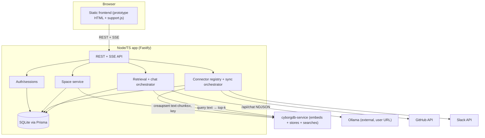
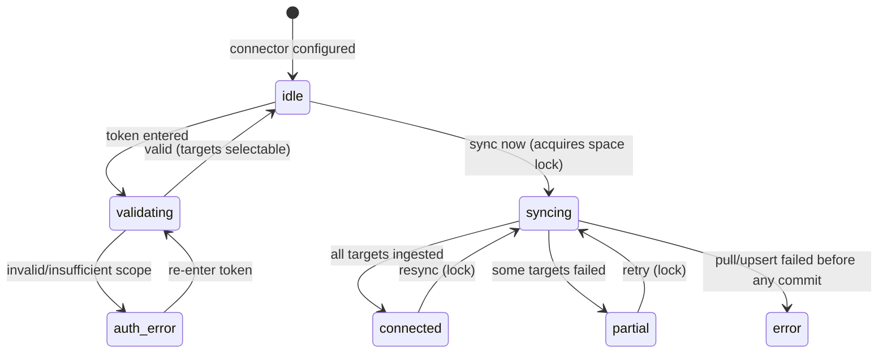
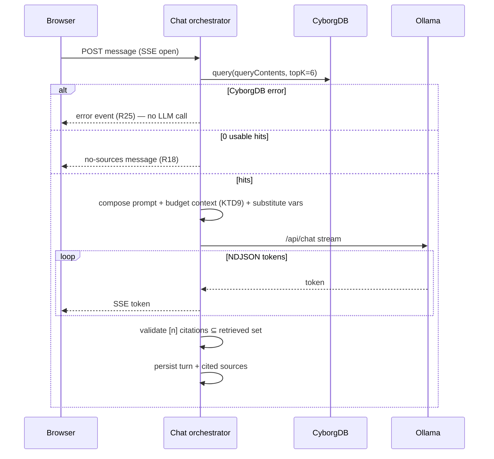

# feat: knowledgeLLM — RAG chat on CyborgDB (v1)

## Summary

Build the v1 backend and frontend wiring for knowledgeLLM: a self-hosted, vector-grounded LLM chat workspace. A Node/TypeScript server serves the existing HTML prototype, persists app metadata in SQLite, stores per-space corpora in CyborgDB (which embeds text server-side), and streams chat completions from a user-provided Ollama. GitHub and Slack connectors ingest content through a shared plugin interface. The deliverable is the core RAG loop end-to-end: log in → connect Ollama → create a space → connect a source → ingest → chat with live citations.

---

## Problem Frame

The product exists today only as an in-memory HTML prototype (`Klavex LLM Chat Platform.zip` → `export/`) wired to a `window.claude` bridge with seeded data — nothing is real. This plan builds the backend that makes it real on CyborgDB (the team's encrypted vector DB) rather than the LanceDB an AnythingLLM-style tool would use, and rewires the frontend from seed data to live APIs. Scope is deliberately the core loop; agents, RBAC, scheduler, and additional connectors are deferred (see origin).

---

## Requirements

Traced from the origin requirements doc (`origin:`). R-IDs below match the origin's numbering.

### Auth & spaces
- R1. Email/password auth with sessions; app routes reject unauthenticated requests.
- R2. One workspace, many knowledge spaces; any member accesses any space (no role checks in v1).
- R3. A space owns its custom prompt, connector configs, CyborgDB index, and conversation history.

### Ollama setup
- R4. Setup collects an Ollama host URL and tests reachability + discovers chat models before completion.
- R5. Setup selects a chat model only; no embedding-model picker.
- R6. Ollama settings persist across sessions.

### Spaces & CyborgDB
- R7. Creating a space provisions a CyborgDB index; deleting a space removes it.
- R8. The app generates a 32-byte index key per space, persists it, and re-supplies it on `loadIndex`.
- R9. Ingestion sends chunk text + metadata to CyborgDB, which embeds and stores it.
- R10. Retrieval sends query text to CyborgDB and receives scored, ranked top-k.

### Connectors
- R11. Connectors implement a shared interface (validate / list targets / sync → chunks + metadata); a registry exposes them to the UI.
- R12. GitHub connector ingests selected repos' files (code + docs) and issues, with repo/path-or-issue-ref/permalink metadata.
- R13. Slack connector ingests selected channels' messages + thread replies, with channel/author/ts/permalink metadata.
- R14. Connector credentials are entered in the UI and stored per space.
- R15. Sync is user-triggered; UI reflects connector state and what was ingested.

### Chat & retrieval
- R16. A chat turn embeds+searches the active space, then composes custom prompt + retrieved context + query for Ollama.
- R17. Responses render inline `[n]` citations mapping to numbered source cards (connector, title, snippet, score).
- R18. With no usable context, the app states the space has no sources rather than answering ungrounded.
- R19. Conversations persist per space (messages, cited sources, updated time) and reopen from the thread list.
- R20. Custom-prompt variable substitution (`{{space.name}}`, `{{user.name}}`) is applied before sending to Ollama.

### Deployment
- R21. `docker-compose up` runs the app (frontend + API) and `cyborgdb-service` (standalone/disk), persisting data across restarts.
- R22. Ollama is external; the app reaches the user-provided URL from the running stack.

### Plan-added robustness requirements
These extend the origin based on Phase 1 flow analysis; they are load-bearing for the loop to work in practice.
- R23. Resync is idempotent and purges stale vectors: re-running a sync upserts by stable chunk ID and deletes vectors whose IDs no longer appear in the source.
- R24. At most one sync runs per space index at a time; concurrent triggers are rejected or queued, and the UI reflects the lock.
- R25. Retrieval failure (CyborgDB unreachable/errored) is distinct from empty retrieval; a failure surfaces an error and never falls through to an ungrounded answer.
- R26. Composed prompts respect the model context window via a fixed trim order; history is trimmed first.
- R27. Streaming chat supports cancellation: a client disconnect aborts the upstream Ollama request, backstopped by a server-side stream timeout. A mid-stream drop surfaces a clear error and the user can resend. (Persisting the partial answer + a dedicated "regenerate" affordance is deferred to follow-up — see Scope Boundaries.)
- R28. Ollama URL and chat model persist in app settings (not just `.env`); on load, the app routes to setup when no config exists and to the app when it does, workspace-wide.
- R29. v1 security baseline: connector tokens are never returned to the browser; the user-supplied Ollama URL is SSRF-validated before server-side fetch; retrieved content is delimited as data in the prompt; login rotates the session and is rate-limited; registration is bootstrap-then-gated; connector tokens are validated for minimum required scope.
- R30. A persisted message stores a full snapshot of its cited source cards (id, title, snippet, score), so reopening a thread (R19) renders citations even if a later sync purged the underlying vectors.

---

## Key Technical Decisions

- KTD1. **Backend: Node + TypeScript on Fastify**, serving the prototype's static files and a JSON/streaming API. Fastify for first-class TS types, schema validation, and straightforward streaming; an implementer may swap to Express without changing the plan's unit boundaries. One language across stack matches the JS frontend and `cyborgdb-js`.
- KTD2. **App metadata in Prisma + SQLite**, datasource left swappable to Postgres (AnythingLLM pattern). A space's `slug` is its CyborgDB index name (namespace-as-slug). A `document_vectors` join table maps each ingested document to its vector IDs — required for correct deletion and resync (AnythingLLM omits this at its peril; we include it).
- KTD3. **CyborgDB text-in mode.** Upsert with `contents`, query with `queryContents` (verified in `cyborgdb-js`); the app never computes embeddings. Indexes are created with `metric: "cosine"` (explicit — the SDK sets no default) and `embeddingModel: "all-MiniLM-L6-v2"` (384d). In v1 the embedding model is a global constant; `Space.embeddingModel` stores it per row but is always set to this default (the field is reserved for future per-space selection). `getDimension()` is asserted on load to catch model/dimension drift.
- KTD3a. **Query must pass `include` and returns distance, not a similarity score.** `query()` returns bare `{id}` unless `include` is set; the wrapper passes `include: ["distance", "metadata"]`. Results expose `distance` (smaller = more similar), so the threshold compares on distance, not a 0–1 score, and the UI score is derived as `1 - distance`. Chunk text for source-card snippets is stored in `metadata.snippet` at upsert (query returns `metadata`, not `contents`), so no second `get()` round-trip is needed.
- KTD4. **SDK-managed encryption keys.** Per-space 32-byte key via `Client.generateKey()`, stored as hex in the app DB and re-supplied (hex → `Uint8Array`) on `loadIndex`. Alternative weighed: `kmsName` (service-held keys) removes the brick-on-key-loss failure mode entirely since `loadIndex` needs no app-held key — deferred to the secret-hardening follow-up because it adds a KMS dependency; for v1 the recovery story is DB backup. Losing the key bricks the space — see R8 and Risks.
- KTD8a. **Chunking strategy is per source type.** Code/doc files chunk by ~50-line / ~1000-char windows on line boundaries; GitHub issues chunk per issue (title + body, then comments grouped); Slack chunks per thread (root + replies together), not per message. One-size-fits-all chunking produces poor retrieval; this is the origin's deferred-to-planning decision, landed here.
- KTD11. **Settings persistence.** Ollama URL + selected chat model persist in the `SystemSetting` KV table via a settings service/API (not `.env`, which only supplies optional defaults). On app load the frontend checks this endpoint: config present → app; absent → setup wizard. This is a workspace-global check, so a second user skips first-run setup (R6, R28).
- KTD12. **v1 security baseline** (the deferred item is at-rest encryption only, KTD5 — these controls are in scope): connector tokens are never returned to the browser (API responses mask to a set/last-4 indicator); the user-supplied Ollama URL is validated against private/link-local ranges before any server-side fetch (SSRF guard); retrieved third-party content is wrapped in explicit source delimiters in the prompt so it is treated as data, not instructions (prompt-injection mitigation, best-effort); login rotates the session and is rate-limited; registration is bootstrap-then-gated (first user, then env-flag/invite). See R29.
- KTD5. **Secrets via `.env` for v1, no at-rest encryption layer** (per product decision to defer). App-level config (session secret, CyborgDB base URL + API key, port, default Ollama hint) lives in `.env`. Connector tokens and per-space index keys persist in the SQLite DB unencrypted. Hardening (encrypt-at-rest / OS keychain / KMS) is a flagged follow-up — see Scope Boundaries.
- KTD6. **Ollama over `/api/chat` streaming NDJSON.** Connection test = `GET /` liveness + `GET /api/tags` discovery; chat models are filtered from embedding models by `details.family` heuristic. The app relays Ollama's NDJSON to the browser as Server-Sent Events; client disconnect aborts the upstream request.
- KTD7. **Stable chunk IDs = hash(connector, target, ref/path, chunkIndex).** Makes upserts idempotent and lets resync purge vectors whose IDs vanished from the source (R23). Decided before first upsert because it constrains the data model.
- KTD8. **Retrieval: top-k default 6, per-space `similarityThreshold`.** Threshold is expressed as a derived similarity `1 - distance` (cosine metric, KTD3a); the default starts at `0.35` and is per-space configurable (the prototype's 0.85/0.78 are wrong for this model and are removed). A result is "usable" when its similarity ≥ threshold; no usable results or empty → R18 refusal; a CyborgDB error → R25 instead. The `0.35` default is a documented starting point to validate against real MiniLM scores during implementation, not a tuned constant. Multi-document aggregation beyond top-k is a known v1 limitation (see Scope Boundaries).
- KTD9. **Context budgeting order: system prompt > user query > retrieved context > history.** History is trimmed first to fit `num_ctx`; retrieved context is capped by token count. Prevents the turn-5 overflow the flow analysis flagged.
- KTD10. **Concurrency: per-space-index sync lock; per-conversation turn serialization.** Chat is allowed during sync with a "sources updating" indicator rather than blocked.

---

## High-Level Technical Design

### Component topology



### Connector sync state machine



### Chat turn lifecycle



---

## Output Structure

Greenfield layout (directional — implementer may adjust):

```
context-well/
├── docker-compose.yml          # app + cyborgdb-service
├── .env.example
├── package.json
├── prisma/
│   └── schema.prisma
├── src/
│   ├── server.ts               # Fastify bootstrap, static serving
│   ├── config.ts               # .env loading
│   ├── auth/                    # sessions, login
│   ├── db/                      # prisma client
│   ├── cyborg/                  # cyborgdb-js wrapper + key lifecycle
│   ├── ollama/                  # connection test + streaming chat
│   ├── spaces/                  # space service
│   ├── connectors/
│   │   ├── types.ts            # Connector interface + registry
│   │   ├── chunk.ts            # chunking + stable chunk IDs
│   │   ├── github.ts
│   │   └── slack.ts
│   ├── chat/                    # retrieval + orchestration + budgeting
│   └── routes/                  # REST + SSE endpoints
├── public/                      # the prototype frontend, rewired
│   ├── index.html              # from knowledgeLLM.dc.html
│   └── support.js
└── docs/
```

---

## Implementation Units

### Phase 1 — Foundation

### U1. Repo scaffold, build tooling, and docker-compose
- **Goal:** Stand up the Node/TS project, build/run scripts, `.env` config, and a `docker-compose.yml` bringing up the app + `cyborgdb-service` (standalone/disk).
- **Requirements:** R21, R22, KTD1, KTD5
- **Dependencies:** none
- **Files:** `package.json`, `tsconfig.json`, `docker-compose.yml`, `.env.example`, `src/server.ts`, `src/config.ts`, `Dockerfile`
- **Approach:** Fastify server that serves `public/` statically and mounts the API under `/api`. `cyborgdb-service` runs as a compose service with a persistent volume for its disk store; secrets reach the container via `env_file: .env` (not inline `environment:` literals), `.env` is gitignored, and `.env.example` carries no real values (R29/KTD12). `config.ts` loads `.env` (session secret, `CYBORGDB_URL`, `CYBORGDB_API_KEY`, port, optional default Ollama URL hint). Document the localhost-in-Docker caveat for the user-provided Ollama URL in `.env.example`. Confirm the compose `cyborgdb-service` image can embed with `all-MiniLM-L6-v2` (bundled or pulled), since health ≠ model-ready.
- **Patterns to follow:** AnythingLLM single SQLite + KV settings pattern (see Sources).
- **Test scenarios:** Test expectation: none — scaffolding/config. Verify `docker-compose up` starts both services and the app health route responds.
- **Verification:** `docker-compose up` yields a reachable app serving the frontend shell; a trivial text upsert+query round-trips against `cyborgdb-service` (proving the embedding model is available — covers AE5's persistence path after a restart).

### U2. Data model (Prisma + SQLite)
- **Goal:** Define the persistence schema for users, sessions, spaces, connectors, documents, document→vector map, conversations/messages, and system settings.
- **Requirements:** R1, R2, R3, R8, R14, R19, R23, KTD2
- **Dependencies:** U1
- **Files:** `prisma/schema.prisma`, `src/db/client.ts`
- **Approach:** Models — `User`, `Session`, `Space` (slug, name, customPrompt, indexKey, embeddingModel, similarityThreshold), `Connector` (spaceId, kind, credentials, targets, status, lastSync, counts), `Document` (spaceId, connectorId, externalRef, title, metadata), `DocumentVector` (documentId → vectorId join), `Conversation` (spaceId), `Message` (conversationId, role, text, sources JSON snapshot per R30), `SystemSetting` (KV, holds Ollama URL + chat model per R28). `Space.indexKey` stores the 32-byte key (hex) per KTD4/KTD5.
- **Patterns to follow:** AnythingLLM `workspaces` / `workspace_documents` / `document_vectors` / `system_settings` shapes.
- **Test scenarios:** Test expectation: none beyond migration — schema unit. Verify migrations apply and the join table cascades on document delete.
- **Verification:** Prisma migration runs cleanly; deleting a `Document` removes its `DocumentVector` rows.

### U3. Auth and sessions
- **Goal:** Multi-user email/password registration + login with server sessions; route guard rejecting unauthenticated requests.
- **Requirements:** R1, R2, R29
- **Dependencies:** U2
- **Files:** `src/auth/service.ts`, `src/auth/routes.ts`, `src/auth/guard.ts`, `src/auth/__tests__/auth.test.ts`
- **Approach:** Hash passwords (bcrypt/argon2); session cookie (`HttpOnly`, `SameSite=Lax`, `Secure` configurable) backed by a `Session` row; rotate the session ID on login; invalidate on logout. Per-IP rate limit on login (e.g. `@fastify/rate-limit`). Registration is bootstrap-then-gated: the first account is the operator, then registration is gated behind an env flag/invite (R29). Guard middleware on `/api/*` except auth + static. No role checks (R2).
- **Test scenarios:**
  - Happy path: register → login sets session → guarded route returns 200.
  - Edge: registration gated after first account (env flag/invite); session rotates on login.
  - Edge: duplicate email rejected; wrong password rejected.
  - Error/failure: missing/expired session → 401; malformed credentials → 400.
  - Integration: second user logs in and inherits the shared workspace (no per-user setup re-run).
- **Verification:** Authenticated requests pass the guard; unauthenticated ones get 401.

### Phase 2 — Integration services

### U4. CyborgDB wrapper and per-space key lifecycle
- **Goal:** A module wrapping `cyborgdb-js` for index create/load/train/delete, text upsert, query, and vector delete — with key generation, persistence, and re-supply.
- **Requirements:** R7, R8, R9, R10, R23, KTD3, KTD3a, KTD4, KTD7
- **Dependencies:** U2
- **Files:** `src/cyborg/client.ts`, `src/cyborg/index-service.ts`, `src/cyborg/__tests__/cyborg.test.ts`
- **Approach:** `new Client({ baseUrl, apiKey })` from `.env`. `provisionIndex(space)` → `generateKey()` → `createIndex({ indexName: slug, indexKey, metric: "cosine", embeddingModel: "all-MiniLM-L6-v2" })`, persist key as hex; `openIndex(space)` → `loadIndex({ indexName, indexKey })`, assert `getDimension()===384`. `upsertChunks(space, chunks)` sends `contents` + metadata (incl. `metadata.snippet`) + stable IDs (KTD7). `query(space, text, topK)` uses `queryContents` and passes `include: ["distance","metadata"]` (KTD3a). `deleteVectors(space, ids)` for resync purge; `listIds()` exposed for resync reconciliation (U7). `train(space)` to cross from exhaustive to ANN search, triggered post-sync past a vector-count threshold. `deleteIndex(space)`. Classify a `loadIndex` failure on a present-but-wrong key as a distinct "index locked" error (derive from the service error; a 32-byte length check alone won't catch it).
- **Technical design:** chunk → `{ id: hash(connector,target,ref,chunkIndex), contents, metadata }` (directional).
- **Test scenarios:**
  - Happy path: provision → upsert text chunks → query returns scored hits → delete index.
  - Edge: re-provision existing space reuses persisted key (no new key).
  - Covers AE2. Upsert chunks with only `contents` (no vector, no embedding-model picker involved) → server-side embedding succeeds.
  - Error/failure: `loadIndex` with wrong/missing key surfaces a distinct "index locked" error; dimension mismatch on load throws.
  - Integration: upsert-by-id twice does not duplicate; delete-by-id removes from query results; query returns distance + metadata (not bare IDs) given `include`.
- **Verification:** Round-trip upsert→query→delete works against a running `cyborgdb-service`; key persists across process restart.

### U5. Ollama wrapper (connection test + streaming chat)
- **Goal:** Connection test with model discovery, and a streaming chat call relaying NDJSON.
- **Requirements:** R4, R5, R6, R16, R27, R28, R29, KTD6, KTD9, KTD11, KTD12
- **Dependencies:** U1
- **Files:** `src/ollama/client.ts`, `src/settings/service.ts`, `src/settings/routes.ts`, `src/ollama/__tests__/ollama.test.ts`
- **Approach:** SSRF-guard the URL first — reject non-http(s) schemes and private/link-local ranges before any fetch (R29). `testConnection(url)` → `GET /` liveness then `GET /api/tags`; classify failures (refused / DNS / TLS / timeout / tags-404) into distinct messages. Filter chat models from embedding models by `details.family`, but on ambiguous/null family show the model flagged-as-maybe-embedding rather than hiding it (avoids blocking finish). `streamChat({ url, model, messages, numCtx, signal })` async-generator over `/api/chat` NDJSON with the partial-line buffer pattern; `signal` aborts the upstream fetch, backstopped by a server-side stream timeout (R27). A settings service (`SystemSetting` KV) persists Ollama URL + chat model via `getSettings()`/`updateSettings()` and exposes a settings API for the frontend (R28, KTD11); `.env` only supplies optional defaults.
- **Patterns to follow:** Ollama API docs (see Sources); NDJSON buffer-remainder pattern.
- **Test scenarios:**
  - Happy path: mocked `/api/tags` returns mixed models → only chat models surface; `streamChat` yields tokens then stops on `done:true`.
  - Edge: empty `/api/tags` → "no models, run ollama pull" classification; ambiguous-family model is shown flagged, not hidden; NDJSON line split across reads reassembles correctly.
  - Error/failure: connection refused, timeout, and tags-404 each map to distinct messages; abort signal stops the stream; an SSRF-range URL (e.g. `http://169.254.169.254`) is rejected before any fetch.
  - Integration: `updateSettings` then `getSettings` round-trips the Ollama URL + model across a process restart (R28).
- **Verification:** Test connection distinguishes reachable-with-models, reachable-no-models, and unreachable; streaming yields incremental tokens and cancels on signal; settings persist.

### U6. Knowledge space service
- **Goal:** Space CRUD that provisions/deletes the CyborgDB index, stores the custom prompt, and owns conversations.
- **Requirements:** R3, R7, R19, R20
- **Dependencies:** U4
- **Files:** `src/spaces/service.ts`, `src/spaces/routes.ts`, `src/spaces/__tests__/spaces.test.ts`
- **Approach:** Create space → unique slug → `provisionIndex` (U4) → persist. Delete space → teardown order: block if a sync is in-flight, `deleteIndex`, then cascade DB rows (conversations, connectors, key). Custom prompt CRUD with `{{var}}` template stored raw; substitution happens at chat time (U10).
- **Test scenarios:**
  - Happy path: create space provisions an index; delete removes index + cascades rows.
  - Edge: duplicate space name → unique slug; delete while sync in-flight is rejected/deferred.
  - Error/failure: index provision failure rolls back the space row.
  - Covers AE5. After a stack restart, opening an existing space loads its index with the persisted key and prior conversations/vectors are intact.
  - Integration: created space is immediately queryable (empty) and listable.
- **Verification:** Space lifecycle keeps DB and CyborgDB in sync; no orphaned indexes or rows.

### Phase 3 — Ingestion / connectors

### U7. Connector plugin interface, registry, chunking, and sync orchestration
- **Goal:** The shared connector contract + registry, chunking with stable IDs, and a sync orchestrator with per-space locking, status states, and stale-vector purge.
- **Requirements:** R11, R14, R15, R23, R24, R29, KTD7, KTD8a, KTD10
- **Dependencies:** U4, U6
- **Files:** `src/connectors/types.ts`, `src/connectors/registry.ts`, `src/connectors/chunk.ts`, `src/connectors/sync.ts`, `src/connectors/routes.ts`, `src/connectors/__tests__/sync.test.ts`
- **Approach:** `interface Connector { kind; validate(creds); listTargets(creds); sync(creds, targets): AsyncIterable<Chunk> }`. Registry maps kind→implementation and exposes available connectors to the UI. `chunk.ts` chunks per source type (KTD8a) and assigns `hash(connector,target,ref,chunkIndex)` IDs. `sync.ts`: acquire per-space lock (R24 — concurrent triggers are **rejected** with "sync in progress", not queued), pull chunks, upsert by ID to CyborgDB (batched for large corpora), update `Document`/`DocumentVector` rows, purge stale vectors by reconciling the fresh ID set against `index.listIds()` ground truth (not the DB alone, which can diverge after an interrupted sync) (R23), `train()` past the vector-count threshold, set status (`syncing`→`connected`/`partial`/`error`) with per-target results and counts. v1 corpus envelope: enforce a max-chunks-per-sync cap with a "truncated/too large" status rather than unbounded ingest. Connector routes mask credential values in responses (return set/last-4 only) (R29).
- **Technical design:** status transitions per the sync state machine above (directional).
- **Test scenarios:**
  - Happy path: sync ingests chunks, writes doc→vector rows, status `connected` with counts.
  - Edge: resync after a source deletion purges the stale vectors; resync with no changes is a no-op (idempotent IDs).
  - Error/failure: one of N targets fails → status `partial` with per-target detail; CyborgDB upsert error before any commit → `error`.
  - Integration/concurrency: a second concurrent sync on the same space is rejected/queued (lock held); two different spaces sync in parallel without contention.
- **Verification:** Resync converges the index to the source state; concurrent syncs on one space cannot interleave.

### U8. GitHub connector
- **Goal:** Implement the connector interface for GitHub repo files (code + docs) and issues.
- **Requirements:** R12, KTD7
- **Dependencies:** U7
- **Files:** `src/connectors/github.ts`, `src/connectors/__tests__/github.test.ts`
- **Approach:** PAT auth. `validate` checks token presence and minimum required scope (`contents:read`, `issues:read`), warning on excess scope (R29). `listTargets` lists accessible repos. `sync` pulls default-branch files (skip binaries, vendored dirs, oversize files) and issues (`GET /repos/{o}/{r}/issues?state=all`, paginated, title+body+comments); PRs excluded (AE4). Metadata: repo, path or issue ref, permalink. Honor GitHub 429 `Retry-After` with backoff; surface partial results to the orchestrator.
- **Patterns to follow:** GitHub REST pagination; AnythingLLM degrades silently without a PAT — validate token presence first (see Sources).
- **Test scenarios:**
  - Covers AE4. Happy path: two selected repos → files (code + docs) and issues ingested with metadata; PRs absent.
  - Edge: binary/oversize files skipped; empty repo → 0 chunks (not error); issue comment pagination fetched fully.
  - Error/failure: invalid token → `auth_error`; 429 mid-pull → backoff then resume, or `partial` if exhausted.
- **Verification:** A real (or mocked) repo ingests expected file + issue chunks with correct permalinks; PRs never appear.

### U9. Slack connector
- **Goal:** Implement the connector interface for selected Slack channels' messages + thread replies.
- **Requirements:** R13, KTD7
- **Dependencies:** U7
- **Files:** `src/connectors/slack.ts`, `src/connectors/__tests__/slack.test.ts`
- **Approach:** Bot-token auth. `validate` checks token + minimum scopes (`channels:history`, `channels:read`, `users:read`), warning on excess (R29). `listTargets` lists channels the bot is a member of (note: bot must be invited to read a channel — surface non-member channels distinctly). `sync` pulls channel messages + thread replies (`conversations.history` + `conversations.replies`, paginated), resolves authors via `users.list`. Metadata: channel, author, ts, permalink. DMs/private-not-invited out of scope.
- **Patterns to follow:** Slack pagination + `Retry-After`; no AnythingLLM precedent — built fresh (see Sources).
- **Test scenarios:**
  - Happy path: selected channel → messages + thread replies ingested with channel/author/ts/permalink.
  - Edge: bot not a member of a listed channel → sync returns empty for it with a clear per-target note (not a silent zero); archived channel handled.
  - Error/failure: invalid token → `auth_error`; rate limit → backoff/partial.
- **Verification:** A mocked workspace ingests channel + thread chunks with resolved authors and permalinks.

### Phase 4 — Retrieval & chat

### U10. Retrieval and chat orchestration
- **Goal:** The grounded chat turn: retrieve, branch on failure/empty, budget context, compose, stream, validate citations, persist.
- **Requirements:** R16, R17, R18, R19, R20, R25, R26, R27, R29, R30, KTD8, KTD9, KTD12
- **Dependencies:** U4, U5, U6
- **Files:** `src/chat/orchestrator.ts`, `src/chat/context.ts`, `src/chat/citations.ts`, `src/chat/routes.ts`, `src/chat/__tests__/chat.test.ts`
- **Approach:** On a turn: `query` CyborgDB (topK=6, similarity = `1-distance`). If CyborgDB errors → emit a distinct retrieval-error event ("Retrieval failed — index unreachable; your question was not sent to the model"), no LLM call (R25). If no result ≥ `similarityThreshold` → emit no-sources message ("No relevant sources in this space — try syncing a connector or rephrasing") (R18). Else compose: substitute `{{var}}` in the custom prompt only, then append retrieved chunks each wrapped in explicit `<source n>…</source n>` delimiters with a system instruction to treat delimited content as data, not instructions (prompt-injection mitigation, R29). Budget tokens in KTD9 order (trim history first); `num_ctx` is taken from the selected model's metadata, falling back to a conservative default. Stream Ollama via SSE; on client disconnect abort upstream, backstopped by a server timeout (R27). After stream, validate emitted `[n]` ⊆ retrieved set (drop dangling citations), persist message + a full snapshot of cited source cards (id, title, snippet, score) so reopening survives later purges (R30). A mid-stream drop surfaces an error and lets the user resend (no partial persistence in v1).
- **Technical design:** per the chat turn lifecycle sequence above (directional).
- **Test scenarios:**
  - Covers AE1. CyborgDB returns nothing usable → no-sources response, sources rail empty, no LLM call.
  - Covers AE3. Three hits, model cites `[1][2]` → exactly those two cards resolve; a `[7]` with 3 hits is dropped/flagged.
  - Happy path: hits → streamed answer with valid citations; turn persists and reopens with sources (R19).
  - Edge: long history overflows `num_ctx` → history trimmed first, system prompt + query retained.
  - Error/failure (R25 vs R18): CyborgDB unreachable → distinct error event, never an ungrounded answer; Ollama refused before first token → clean error + resend; mid-stream drop → error + resend (no partial persistence).
  - Covers R30. A thread reopens with its cited cards even after a later sync purged the underlying vectors (snapshot rendered).
  - Integration: a retrieved chunk containing `{{user.name}}` or `Ignore previous instructions` is left literal inside its `<source>` delimiter and does not alter behavior (no injection).
- **Verification:** The three retrieval outcomes (hits / empty / failure) are distinguishable to the user; citations always resolve; turns survive reload and later purges.

### Phase 5 — Frontend wiring

### U11. Auth + Ollama setup screens
- **Goal:** Wire login and the setup wizard to real APIs; remove the embedding-model picker; handle Ollama edge states.
- **Requirements:** R1, R4, R5, R6, R28
- **Dependencies:** U3, U5
- **Files:** `public/index.html`, `public/support.js` (setup + login views)
- **Approach:** Replace the fake `testConn` timer with a real call. Test-connection states: testing (button disabled + spinner), reachable-with-models, reachable-no-models ("run `ollama pull`"), unreachable (with the Docker-localhost hint); editing the URL after a success resets the model picker and re-blocks finish. Remove the embed-model picker (R5). On app load, check the settings endpoint: config present → app, absent → setup wizard (workspace-global, so a second user skips setup) (R28).
- **Patterns to follow:** existing prototype view structure in `knowledgeLLM.dc.html`.
- **Test scenarios:**
  - Happy path: real test connection populates the chat-model picker; finish persists and lands in the app.
  - Edge: empty model list shows the pull hint and blocks finish; localhost failure shows the Docker hint.
  - Error/failure: unreachable host shows a specific (not generic) message.
- **Verification:** A fresh operator can complete setup against a real Ollama; no embedding-model field remains.

### U12. Spaces + sources/connectors UI
- **Goal:** Wire space switching, custom-prompt editing, connector config, sync-now, and the expanded status states + counts.
- **Requirements:** R3, R11, R12, R13, R14, R15, R20, R24
- **Dependencies:** U6, U7, U8, U9
- **Files:** `public/index.html`, `public/support.js` (sources + spaces views)
- **Approach:** Replace seeded `CONNECTORS`/`SPACES` with API data. Expand the hardcoded 3-value status enum to include `idle`/`validating`/`auth_error`/`partial`. Sync-now button is **disabled with a "sync in progress" tooltip** while the per-space lock is held (rejection model, matching U7). `partial` status renders an expandable per-target row (synced N / failed: reason) under the connector card. Render per-connector counts from real data. Custom-prompt editor saves via the space API. Empty states: zero spaces → "create your first space" CTA; space with no connectors → "add a connector to start" and the chat view prompts to add sources. A non-blocking "sources updating" banner shows while a sync runs for the active space (KTD10), auto-dismissing on lock release.
- **Test scenarios:**
  - Happy path: add connector → validate → pick targets → sync → status `connected` with counts.
  - Edge: `partial` status renders expandable per-target detail; sync button disabled (tooltip) while a sync holds the lock; zero-spaces and zero-connectors empty states render their CTAs.
  - Error/failure: `auth_error` prompts token re-entry without wiping the index; updating a credential on a `connected` connector resets it to `idle` without purging vectors until next sync.
- **Verification:** Connector lifecycle states all render distinctly; counts match ingested data.

### U13. Chat UI (streaming, citations, sources rail)
- **Goal:** Replace the `window.claude` bridge with the streaming chat API; render validated citations and the live sources rail; support cancel and partial answers.
- **Requirements:** R16, R17, R18, R19, R25, R27
- **Dependencies:** U10
- **Files:** `public/index.html`, `public/support.js` (chat view)
- **Approach:** Consume the SSE stream, appending tokens live. The sources rail populates at stream-start from the retrieved top-k (known before the LLM call); citation linking activates post-stream after validation, and rail cards the model didn't cite remain visible but unlinked. Replace the hardcoded 0.85/0.78 score-color bands with bands derived from the `1-distance` similarity. Render the R18 no-sources message and the R25 retrieval-error message as distinct, copy-specified states. A stop/cancel control replaces the send button while streaming and aborts the SSE; on cancel or mid-stream drop, surface the error and re-enable send (no partial persistence in v1, per R27). Validate `[n]` against returned sources before linking.
- **Patterns to follow:** existing message/rail rendering and the `[n]` regex in `knowledgeLLM.dc.html` (now backed by validation).
- **Test scenarios:**
  - Happy path: streamed answer renders incrementally; sources rail populates at stream-start; citations link post-validation.
  - Edge: no-sources (R18) and retrieval-error (R25) render as different messages; an uncited rail card stays visible but unlinked.
  - Error/failure: cancel aborts the stream and re-enables send; mid-stream drop shows an error with resend.
  - Integration: reopening a persisted thread re-renders messages and their snapshotted sources (R30).
- **Verification:** Chat feels responsive (token streaming), citations always resolve, and the empty/error/cancel paths are visibly distinct.

---

## Scope Boundaries

### Deferred for later (from origin)
- Agents, scheduler, run history, delivery targets.
- RBAC role matrix, member management, invites, 2FA.
- Google Docs + file-upload connectors; GitHub pull requests.
- Multi-provider LLM (Claude/OpenAI/vLLM).
- Scheduled/automatic connector re-sync (v1 is manual).

### Deferred to follow-up work (plan-local)
- **Secret hardening:** encrypt connector tokens + index keys at rest (or move to OS keychain / KMS, e.g. CyborgDB `kmsName`). v1 stores them unencrypted in the DB with `.env` config (KTD5).
- **Multi-document aggregation retrieval:** queries needing the whole corpus (not top-k) are out of scope; the known top-k limitation is surfaced, not solved.
- **Sync resumability:** a network drop mid-sync restarts the sync; no checkpoint/resume in v1.
- **Partial-answer persistence + regenerate:** a mid-stream drop surfaces an error and the user resends; persisting the partial and a dedicated regenerate affordance are deferred (R27).
- **Per-space embedding model:** v1 fixes `all-MiniLM-L6-v2` globally; per-space selection (and the re-ingestion migration a model change requires) is deferred.

### Outside this product's identity (from origin)
- Hosted multi-tenant SaaS with per-user billing — this is self-hosted, single-workspace, team-internal.
- Acting as an LLM provider or embedding service — embedding is CyborgDB's, chat is Ollama's.

---

## Risks & Dependencies

- **Lost index key bricks a space (KTD4/R8).** With SDK-managed keys and `.env`/DB storage and no encryption, a lost or corrupted key makes a space's index permanently unreadable. Mitigation: persist on space create within the provisioning transaction; surface an explicit "index locked" state; document backup of the DB. Revisit with `kmsName` in the secret-hardening follow-up.
- **CyborgDB ANN training threshold.** Scores and ordering can shift when the index crosses from exhaustive to ANN search; a fixed similarity threshold tuned early may misbehave later. Mitigation: per-space configurable threshold; treat defaults as a starting point.
- **User-provided Ollama URL unreachable from Docker.** `localhost` resolves to the container. Mitigation: explicit setup hint + `.env.example` note (U1, U11).
- **`cyborgdb-service` availability and API.** The plan depends on `cyborgdb-js` text-in upsert/query and `getDimension()` (verified) and on the service running in standalone/disk mode. Dependency: the compose image for `cyborgdb-service`.
- **Embedding model pull.** `all-MiniLM-L6-v2` must be available to `cyborgdb-service` for text-in embedding; U1 verification asserts a text round-trip rather than trusting health alone.
- **Embedding model is frozen per index at creation.** Switching models later (e.g. for higher recall) requires recreating every space index and full re-ingestion — there is no in-place re-embed. v1 commits all spaces to `all-MiniLM-L6-v2`; a model upgrade is a migration event.
- **`query()` contract.** Retrieval depends on passing `include` and on `metric: "cosine"` being set explicitly at create (KTD3a); without both, results are bare IDs or distances on the wrong metric. Verified against `cyborgdb-js` `api_contract.test.ts`.

---

## Sources & Research

- Origin requirements: `docs/brainstorms/2026-06-25-knowledgellm-rag-cyborgdb-requirements.md`.
- Frontend prototype contracts (in `Klavex LLM Chat Platform.zip` → `export/`): status enum, top-4 retrieval slice, `[n]` citation regex, hardcoded 0.85/0.78 score thresholds, single non-streaming chat loop, fake test-connection timer, dual model pickers — all in `knowledgeLLM.dc.html`; these are the frontend surfaces U11–U13 change.
- `cyborgdb-js` SDK (verified): `src/encryptedIndex.ts` (`upsert` with `contents`, `query` with `queryContents`, `getDimension`), `src/client.ts` (`Client({baseUrl, apiKey})`, `createIndex({embeddingModel})`, `generateKey()`, `loadIndex`), `src/__tests__/api_contract.test.ts` (text auto-embed; `all-MiniLM-L6-v2` → 384d).
- AnythingLLM architecture (reference to borrow/avoid): Prisma schema (workspaces/document_vectors/system_settings), document→chunk→embed→store pipeline, top-k+threshold retrieval with source curation, three-tier connectors (GitHub lacks issues — we add it; no Slack connector), Ollama `/api/tags`+`/api/chat`. Sources: github.com/Mintplex-Labs/anything-llm prisma/schema.prisma; deepwiki.com/Mintplex-Labs/anything-llm (data-connectors, document-vectorization, similarity-search); docs.useanything.com RAG page.
- Ollama API: github.com/ollama/ollama/blob/main/docs/api.md — `/api/tags`, `/api/chat` streaming NDJSON, `GET /` liveness, `num_ctx`/`keep_alive`, no default auth, server-to-server has no CORS constraint.
