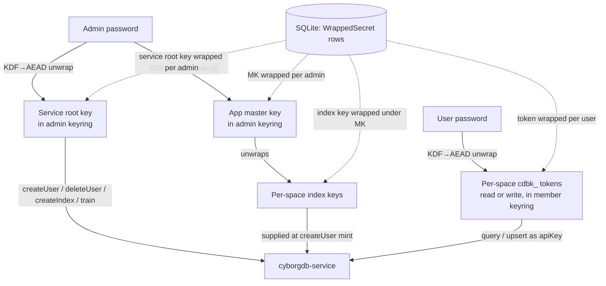

# feat: Team Management & Per-Space Access Control

## Summary

Add per-space access control to Context Well. A two-tier role model (workspace `owner`/`admin` who hold the CyborgDB root key; per-space `editor`/`viewer`) is enforced by app-layer role checks on every space-scoped route *and* by per-user CyborgDB `cdbk_` tokens (viewer=read, editor=write). An app master key (which wraps the per-space index keys) and the CyborgDB service root key are each wrapped under every admin's password; per-user tokens are wrapped under each user's password; all are unwrapped only into an in-process per-session keyring at login, so the running app holds usable keys only for whoever is currently logged in. Onboarding moves to admin-provisioned accounts (temp passwords); open registration is removed.

---

## Problem Frame

Context Well authenticates users but performs **no authorization** beyond a session-existence check ([src/auth/guard.ts:16-37](src/auth/guard.ts#L16-L37)). Every space/connector/chat/upload route then trusts any logged-in user equally ([src/spaces/routes.ts:79-94](src/spaces/routes.ts#L79-L94), [src/chat/routes.ts:41-71](src/chat/routes.ts#L41-L71), [src/uploads/routes.ts:41-94](src/uploads/routes.ts#L41-L94)). The `Space` model has no owner or membership ([prisma/schema.prisma:34-47](prisma/schema.prisma#L34-L47)); each space uses one shared 32-byte index key stored as plaintext hex, and `cyborgdb-service` currently runs with auth disabled ([src/cyborg/client.ts:1-15](src/cyborg/client.ts#L1-L15)). This is the gating feature before more than one person uses the app (see origin: docs/brainstorms/2026-06-26-team-access-control-requirements.md).

Research resolved the two load-bearing unknowns the brainstorm deferred:

- **The service auto-trains on upsert** server-side; `train()` is root-only but is not needed on the ingest path. An editor with a write token can ingest with no admin online.
- **Per-user `cdbk_` tokens work on SDK-supplied-key indexes**, not only KMS-backed ones — the minter passes the index key at `createUser` time and thereafter the token alone opens the index. Since the service supports **no local KMS** (AWS-only), this is the path: keep SDK-supplied keys, no KMS migration.

---

## Requirements

### Roles & enforcement
- R1. Two-tier roles: `owner`/`admin` are workspace-level (hold the root key); `editor`/`viewer` are per-space. No membership = no access to that space. (origin R2)
- R2. Every space-scoped route checks the caller's role for the target space, in addition to the session check; the space list returns only spaces the caller may access. (origin R5, R6)
- R3. Per-user CyborgDB tokens enforce read vs write at the database: viewer=read, editor=write. A viewer's token cannot upsert even if an app check is missing. (origin R7)
- R4. Removing or lowering a member's role revokes their CyborgDB token at the service and drops their in-session tokens immediately. (origin R8)

### Key & token custody
- R5. An app master key and the CyborgDB service root key are stored only as per-admin password-wrapped envelopes, and each per-space index key is wrapped under the master key; none are app-decryptable, and all are unwrapped only into an admin's session keyring. The service root key is rotatable without re-wrapping index keys. (origin R9, R11)
- R6. Each (user, space) membership maps to a `cdbk_` token wrapped under the user's password and unwrapped into their session keyring at login. (origin R10)
- R7. Wrapped secrets and raw tokens/keys never cross the API boundary to the browser. (origin R17 implied; mirrors existing `publicSpace` masking)

### Onboarding & lifecycle
- R8. Admins create accounts with a temporary password; the new account is not auto-logged-in; open self-registration (`ALLOW_REGISTRATION`) is removed and `/register` becomes bootstrap-only. (origin R13)
- R9. A user must change their temp password on first login; tokens provisioned at grant time are re-wrapped under the new password. (origin R14, R15)
- R10. An admin password reset re-mints and re-wraps that user's tokens so they regain their prior spaces and roles. (origin R16)
- R11. The first account becomes `owner` (screen labeled "Create root/admin user"); only the owner promotes/demotes admins; the system refuses any change that would leave zero root-key holders. (origin R1, R3)
- R12. An admin-only Members UI lists users and per-space roles and supports account creation, role grant/change/revoke, admin promote/demote, password reset, and a non-blocking nudge to add a second admin. (origin R17, R18)

### Prerequisite
- R13. `cyborgdb-service` runs with auth enabled and a configured root key; the app constructs its CyborgDB client with that key for root operations, and the root key is verified against the service at bootstrap and first admin login (a valid wrap of the wrong key must fail loudly). (origin Dependencies)

### Safety & accountability
- R14. Every membership/secret-custody change is recorded in an audit log — grant, revoke, role change, promote, demote, account creation, password reset, and rejected invariant violations — with actor, action, target, space, outcome, and timestamp, and no secret material. (plan-time addition beyond origin)
- R15. Temp passwords are CSPRNG-generated (≥128 bits) with a finite validity window; `/login` and admin mutation endpoints are rate-limited to bound online guessing and token-mint storms. (plan-time addition beyond origin)

---

## Key Technical Decisions

- **Defense-in-depth, crypto-primary.** App-layer `requireSpaceRole` guards plus per-user `cdbk_` tokens. App checks deliver isolation; tokens make read/write and revocation enforceable below the app. Both are required — neither alone satisfies the origin's AE2/AE3.

- **Keep SDK-supplied index keys; no KMS.** The service exposes no local KMS (only `aws`/`aws-kms`, per `cyborgdb-service` `kms/config.py`). Per-user tokens work on SDK-keyed indexes by supplying the index key at `createUser`. So index keys stay app-side but move from plaintext `Space.indexKey` into envelopes wrapped under the root key (one per space, not per admin). Reverses the brainstorm's floated KMS alternative.

- **App master key wraps index keys; the service root key is a separate, rotatable credential.** A random app **master key (MK)** is generated at bootstrap and wraps every per-space index key (one envelope per space, under MK). MK is wrapped under each **admin's** password. The CyborgDB **service root key** — the credential authorizing root operations (`createUser`/`deleteUser`/`createIndex`/`train`) — is *also* wrapped under each admin's password, but it never wraps data. Per-user `cdbk_` tokens are wrapped under each **user's** password. Both MK and the service root key sit in the admin keyring, unwrapped together at admin login. Any admin who unwraps MK reaches every index key — including spaces created while offline — so promotion wraps MK + the service root key for the new admin and demotion drops those two envelopes; neither enumerates or orphans index keys. Decoupling MK from the service-root-key *value* means the service root key can be rotated (env change + re-wrap of its envelopes) without touching a single index-key envelope. (Wrapping index keys directly under the service-root-key value was rejected: rotating that credential would brick every space.)

- **In-session keyring is a new first-class component.** Sessions are pure DB rows today with no in-memory store ([src/auth/service.ts:78-99](src/auth/service.ts#L78-L99)). Unwrapped secrets live in an in-process map keyed by session id, populated at login, wiped on logout/expiry/role-change. Never persisted unwrapped, never serialized to the client. The keyring holds the root key and index keys in plaintext for an admin session's lifetime, so host process memory (swap, core dumps) is part of the trust boundary — see System-Wide Impact.

- **KDF/AEAD via `node:crypto`, distinct from the argon2 verifier.** Password login keeps argon2id for verification ([src/auth/service.ts](src/auth/service.ts)). A separate password-derived wrapping key (scrypt → AES-256-GCM) is net-new — argon2 here verifies, it does not yield wrapping-key material. Each user carries a KDF salt and a key verifier (a GCM wrap of a known constant) so first-login/reset can detect a wrong wrapping key and fail loudly instead of minting unusable wraps. The verifier shares the wrapped secrets' KEK, so it adds no exposure beyond them — its only job is loud failure. Non-negotiable crypto floors (not deferred): scrypt cost at least N=2^17 with `maxmem` raised to match (target ~100-250ms/derivation, tunable up); a fresh random 96-bit IV per wrap (`crypto.randomBytes(12)`, never a counter) since GCM key-recovers on IV reuse under one KEK.

- **Audit every membership/secret-custody change.** Grant, revoke, role change, promote, demote, account creation, and password reset — including rejected invariant violations (e.g., a refused last-root-holder demote) — write an audit entry (actor, action, target, space, outcome, timestamp; never secret material). A system whose purpose is access control must be able to answer "who granted whom access to what, when."

- **Deletion revokes tokens before dropping rows.** Deleting a Space or a User must enumerate the affected `cyborgUserId`s and revoke them at CyborgDB *before* cascading Prisma rows or deleting the index, or the per-user tokens orphan service-side (and could resolve against a reused index name). Reconciliation is only the crash backstop, not the primary path.

- **Admins mint per-space tokens on demand, unpersisted.** An admin reaching a space mints a `cdbk_` into their session keyring (root is present), discarded at logout — never wrapped/persisted. So demotion only drops the admin's root envelope; no per-space admin tokens linger.

- **Remove client `train()` from the ingest path.** The service auto-trains on upsert; the existing `train()` call ([src/cyborg/index-service.ts:265](src/cyborg/index-service.ts#L265)) is root-only and must not sit on an editor path. Guard it so it is reachable only with root.

- **Mid-session role change: CyborgDB revocation is the boundary; session teardown is UX.** The authoritative kill is `deleteUser` at the service (immediate, server-side). The DB `Session` row and the in-process keyring are *separate* stores: deleting the session row does not evict the keyring, so revoke/demote must also explicitly drop the target's keyring entries (the keyring needs a `dropSessionsForUser` index — it is keyed by session id alone). An in-flight op that already read the token may complete; the *next* op fails at the service — an accepted window because revocation is server-side-immediate. Post-revoke CyborgDB failures are classified distinctly from `IndexLockedError` so the UI says "access changed," not "chat failed."

- **Cross-system writes order for safe failure.** Grant = mint token → write membership + wrapped-secret in **one Prisma transaction**, with a compensating `deleteUser` if the DB write fails (mirrors the `createSpace` rollback at [src/spaces/service.ts:92-98](src/spaces/service.ts#L92-L98)); a compensating-delete that itself fails does not report success and is left for reconcile. Revoke = write membership change → revoke token, so a crash leaves an over-revoked (safe) state, not under-revoked.

- **Multi-secret operations commit the verifier last, atomically.** Re-wrap on password change, temp-password first-login re-wrap, and password-reset re-mint each touch every one of a user's wrapped secrets (an admin holds root + N index keys; a member holds N tokens). All re-wraps plus the rotated salt and new verifier write in a single transaction with the **verifier written last**, so a partial/interrupted state is detected at next login rather than half-committed (a half re-wrap under a now-gone old password is otherwise permanently unrecoverable). The salt rotates on every password change.

- **Reconciliation is a guarded backstop, not a live tool.** A `listUsers`-vs-membership sweep clears orphaned service users, but it must (a) ignore users younger than a grace threshold so it cannot delete a just-minted token mid-grant, (b) take the same per-(user,space) lock as grant, and (c) also flag the reverse — memberships whose `cyborgUserId` is absent at CyborgDB (under-provisioned) — for alerting, since auto-repair needs an index key only an admin keyring holds.

---

## High-Level Technical Design

Secret custody and who can unwrap what:



**App master key (wraps index keys) and the service root key (auth credential) are each wrapped per admin password; index keys are wrapped under MK; tokens are wrapped per user password.** Any admin reaches every space; the service root key is rotatable without re-wrapping index keys.

Grant-then-first-use sequence (the multi-secret transaction):

```mermaid
sequenceDiagram
  participant Admin
  participant App
  participant CDB as cyborgdb-service
  participant User
  Admin->>App: create account (temp pw) + grant role on space
  App->>CDB: createUser(permissions, index_key from keyring)
  CDB-->>App: { userId, cdbk_ token }
  App->>App: wrap token under temp-pw KEK; write Membership + WrappedSecret
  Note over App: compensating deleteUser if DB write fails
  User->>App: first login (temp pw)
  App->>App: derive temp KEK, verify, unwrap token
  App->>User: force password change
  User->>App: new password
  App->>App: re-wrap token under new KEK; store
```

---

## Implementation Units

Grouped into four phases. Units carry stable U-IDs; dependencies cite U-IDs.

### Phase A — Foundations

### U1. Enable CyborgDB RBAC and wire the root key
- **Goal:** Flip `cyborgdb-service` to auth-enabled with a configured root key; construct the app's CyborgDB client with that key for root operations.
- **Requirements:** R13
- **Dependencies:** none
- **Files:** `docker-compose.yml`, `.env.example`, `src/config.ts`, `src/cyborg/client.ts`
- **Approach:** Add `CYBORGDB_ROOT_KEY` (maps to the service root key / `X-API-Key`; distinct from the `CYBORGDB_API_KEY` license key — see [docs/CYBORGDB-ISSUES.md](docs/CYBORGDB-ISSUES.md) #9). Set the service root key env in compose. The shared client gains a root-authed construction; member operations use a per-call client built with a `cdbk_` token (U7). Pin SDK and service image to the same version (0.17.0, issue #7).
- **Patterns to follow:** existing `required`/`optional` config accessors in `src/config.ts`; `.env.example` documentation style.
- **Test scenarios:**
  - Integration: a client built with the root key can `createUser`/`listUsers`/`deleteUser` against a test index; a client with no key is rejected once auth is enabled.
  - Config: missing `CYBORGDB_ROOT_KEY` fails fast at startup with a clear message.
- **Verification:** With the service auth-enabled, root-keyed calls succeed and unauthenticated calls 401.

### U2. Crypto primitives: password-derived wrapping + AEAD
- **Goal:** Provide KDF + authenticated-encryption helpers to wrap/unwrap secrets under a password, plus a salt + verifier scheme.
- **Requirements:** R5, R6, R9
- **Dependencies:** none
- **Files:** `src/crypto/keywrap.ts`, `src/crypto/__tests__/keywrap.test.ts`
- **Approach:** `node:crypto` scrypt to derive a 32-byte wrapping key from (password, per-user salt) at the floor N≥2^17 with `maxmem` raised to match (target ~100-250ms/derivation, tunable up); AES-256-GCM to wrap/unwrap, with a fresh random 96-bit IV per operation via `crypto.randomBytes(12)` (never a counter or content-derived value — GCM key-recovers on IV reuse under one KEK). Provide `deriveKek`, `wrap`, `unwrap`, `makeVerifier`, `checkVerifier`. The verifier is a GCM wrap of a fixed constant so a wrong KEK is detected before use; it shares the secrets' KEK and adds no exposure beyond them. Keep argon2 (login verification) untouched and separate.
- **Patterns to follow:** reuse `hexToKey`/`keyToHex` (32-byte guard) from `src/cyborg/client.ts` only for byte-length validation; hold live key material as `Buffer`, not long-lived hex strings (strings linger in the heap; Buffers can be zeroized — see U4).
- **Test scenarios:**
  - Happy: wrap then unwrap round-trips arbitrary 32-byte and string secrets.
  - Edge: two wraps of identical plaintext under the same KEK produce different IVs and ciphertext (IV-uniqueness guard).
  - Edge: wrong password → `unwrap` fails the GCM tag (throws), and `checkVerifier` returns false before any unwrap is attempted.
  - Edge: tampered ciphertext/IV → authentication failure, never silent plaintext.
  - Edge: distinct salts yield distinct KEKs for the same password.
- **Verification:** Round-trip and negative cases pass; no plaintext secret is recoverable without the correct password.

### U3. Data model: roles, memberships, wrapped secrets, audit log
- **Goal:** Additive Prisma schema for workspace role, per-space membership, wrapped-secret storage (two-level hierarchy), and an audit log.
- **Requirements:** R1, R5, R6, R11, R14
- **Dependencies:** none
- **Files:** `prisma/schema.prisma`, `prisma/migrations/`, `src/auth/__tests__/setup-env.ts`
- **Approach:** Add `User.workspaceRole` (`owner` | `admin` | `member`), `User.kdfSalt`, `User.keyVerifier`. New `Membership { id, userId, spaceId, role (editor|viewer), cyborgUserId, createdAt, @@unique([userId, spaceId]) }` — `cyborgUserId` is the service `userId` from `createUser` (needed for `deleteUser`); declare both `userId` and `spaceId` relations `onDelete: Cascade`; add a uniqueness guard on `cyborgUserId` (set post-mint) so a revoke can't hit a token another membership still references. New `WrappedSecret { id, userId?, kind (masterKey|rootKey|indexKey|token), spaceId?, ciphertext, iv, createdAt }` keyed by the master-key hierarchy: `masterKey` and `rootKey` rows are per-admin (`userId` set, `spaceId` null); `indexKey` rows are per-space wrapped under the master key (`userId` null, `spaceId` set); `token` rows are per-(user,space). Because SQLite treats NULL as distinct in unique indexes, do **not** rely on a single composite `@@unique` spanning nullable columns — enforce single-row-per-slot at the application layer (or use a non-null sentinel) and test it. New `AuditLog { id, actorUserId, action, targetUserId?, spaceId?, role?, outcome, createdAt }` (no secret columns). Keep `Space.indexKey` for now (U10 nulls it, a later migration drops it). Additive migration only.
- **Patterns to follow:** existing model + relation style in `prisma/schema.prisma`; tests run against the throwaway DB from `setup-env.ts`.
- **Test scenarios:**
  - Migration applies cleanly on a copy of the existing dev DB; existing rows preserved.
  - Constraints: duplicate `(userId, spaceId)` membership rejected; a second `root` envelope for the same admin is rejected (proves the NULL-distinct gap is handled, not silently allowed); duplicate `cyborgUserId` rejected.
  - Cascade: deleting a Space (or User) removes its `Membership`/`WrappedSecret` rows (token revocation itself is U12, not the cascade).
  - `Test expectation:` schema + constraint tests only — behavior lives in U5/U6/U9/U12.
- **Verification:** `prisma migrate` succeeds; constraints hold including the root single-row guard; no data loss on existing DB.

### U4. In-session keyring
- **Goal:** An in-process store holding a session's unwrapped secrets, with a lifecycle bound to the session.
- **Requirements:** R5, R6, R7, R4
- **Dependencies:** U2
- **Files:** `src/auth/keyring.ts`, `src/auth/__tests__/keyring.test.ts`
- **Approach:** A map keyed by session id → `{ rootKey?, indexKeys: Map<spaceId,key>, tokens: Map<spaceId,token> }`. Populated by U5 at login. Methods to get/set/clear; `dropSession(sessionId)` for logout; and `dropSessionsForUser(userId)` for role-change teardown (U9 needs to evict by user, but the map is keyed by session id alone — maintain a userId→sessionIds index). Eviction aligned with `SESSION_TTL_MS`. **Secret-hygiene invariants:** hold key material as `Buffer` and best-effort `.fill(0)` on drop; give the keyring object `toJSON`/`util.inspect` overrides that emit no key material so an accidental `log.info({ keyring })` or a thrown error carrying it cannot exfiltrate; never reachable from `request.user` or any response serializer. Document that a multi-process deployment would need a shared secret store (out of scope; single-process today).
- **Patterns to follow:** module-level singleton like `src/db/client.ts`; the `toAuthUser` strip-secrets discipline in `src/auth/service.ts`, extended to the keyring.
- **Test scenarios:**
  - Happy: set/get round-trips per session; isolation between session ids; `dropSessionsForUser` evicts all of a user's sessions.
  - Edge: `dropSession` removes all material and zeroizes buffers; get after drop returns empty.
  - Edge: expired-session eviction clears entries.
  - Security: `JSON.stringify(keyring)` and `util.inspect(keyring)` contain no key/token material.
  - `Covers AE3.` revoking a session's keyring entry makes subsequent token lookups miss.
- **Verification:** Keyring contents are reachable only by session id, never serialize key material, and are gone after drop/expiry.

### Phase B — Auth & tokens

### U5. Auth integration: bootstrap, login unwrap, logout, temp-password, reset
- **Goal:** Wire crypto + keyring into the auth lifecycle; harden bootstrap; make `/register` bootstrap-only.
- **Requirements:** R8, R9, R10, R11, R13
- **Dependencies:** U1, U2, U3, U4
- **Files:** `src/auth/service.ts`, `src/auth/routes.ts`, `src/auth/types.ts`, `src/auth/__tests__/service.test.ts`
- **Approach:**
  - **Bootstrap (atomic):** first account → `owner`; verify the service is RBAC-enabled *and* that the configured root key actually authenticates against CyborgDB (a cheap root-only call — a valid wrap of the wrong key must fail loudly, not produce a useless envelope); wrap the root key under the owner's password; write owner row + root `WrappedSecret` in one transaction. Recover from "owner exists, no root envelope" rather than dead-ending.
  - **Login:** after argon2 verify, derive the KEK from password + `kdfSalt`, `checkVerifier`, unwrap this user's `WrappedSecret`s into the keyring (root → index keys for admins; tokens for members).
  - **Temp-password first login:** force change; re-derive KEK; rotate the salt; re-wrap all of the user's secrets and write the new `keyVerifier` **last**, all in one transaction (verifier-last so an interrupted re-wrap is detected at next login, never half-committed under a now-gone password).
  - **Password reset (admin):** delegates token re-mint to U6/U9 (admin holds root); the re-mint leg is idempotent and resumable per space (keyed off membership), with the verifier committed last; user's old wraps invalidated.
  - **Logout:** `dropSession` in the keyring.
  - **Registration (server-side, not just UI):** remove `ALLOW_REGISTRATION` (origin R13); the `/register` *route* returns 403 once any user exists regardless of client; later accounts come only from U9's admin flow.
- **Execution note:** Add a failing test for the bootstrap transaction (owner + root envelope written together; partial failure leaves a resumable state) before implementing.
- **Patterns to follow:** `rotateSession` transactional pattern; no-enumeration login behavior; `toAuthUser` stripping secrets.
- **Test scenarios:**
  - `Covers AE6.` admin resets a user's password → user logs in with temp pw, is forced to change it, regains exactly prior spaces/roles; old wraps no longer unwrap.
  - Happy: admin login unwraps root + index keys; member login unwraps only their tokens.
  - Edge: wrong password → no keyring population, generic auth failure (no enumeration).
  - Edge: bootstrap failure after owner row → resume path re-runs root-key wrap; `isFirstAccount` edge handled.
  - Edge: bootstrap with a wrong/misconfigured root key → fails loudly at the positive CyborgDB auth check, no owner-with-useless-envelope state.
  - Edge: `/register` returns 403 (server-side) once a user exists, independent of the client.
  - Failure: temp password mismatch vs what was wrapped → first login fails loudly via verifier, no garbage re-wrap.
  - Failure: re-wrap interrupted partway across an admin's many secrets → next login detects the mismatch (verifier-last) rather than unwrapping some-and-failing-others.
- **Verification:** Login populates the keyring correctly per role; bootstrap is atomic/resumable and root-key-verified; re-wrap is all-or-nothing; registration is bootstrap-only server-side.

### U6. CyborgDB token lifecycle service
- **Goal:** Mint/list/revoke per-index user tokens, wrap them, and supply admin on-demand tokens.
- **Requirements:** R3, R4, R6
- **Dependencies:** U1, U2, U3, U4
- **Files:** `src/cyborg/tokens.ts`, `src/cyborg/index-service.ts`, `src/cyborg/__tests__/tokens.test.ts`
- **Approach:** Wrap the SDK's `createUser({permissions, index_key})` → `{userId, apiKey}`, `listUsers()`, `deleteUser({userId})`. `mintToken(spaceId, perms)` uses the index key from the admin keyring (SDK-supplied path), returns the `cdbk_` and the service `userId`. `wrapTokenForUser` wraps under a target user's KEK (temp-password KEK at grant). `revokeToken(cyborgUserId)` calls `deleteUser`. `adminTokenFor(spaceId)` mints on demand into the admin's keyring (unpersisted), using the index key unwrapped via root. `reconcile()` is a guarded backstop: it deletes service users absent from membership **only** when older than a grace threshold (so it can't kill a just-minted token mid-grant) and takes the same per-(user,space) lock as grant; a second arm flags memberships whose `cyborgUserId` is absent at CyborgDB (under-provisioned) for alerting.
- **Patterns to follow:** existing `index-service` operation wrappers and `IndexLockedError` classification.
- **Test scenarios:**
  - `Covers AE2.` a read-permission token's `upsert` is rejected by the service; a write token's `upsert` succeeds.
  - `Covers AE3.` after `deleteUser`, the token's next call fails immediately, including for an already-open per-call client (revocation is connection-independent — see U7).
  - Happy: mint returns a usable `cdbk_`; `listUsers` reflects it.
  - Integration: a minted write token can query and upsert; a minted read token can query only.
  - Edge: mint with no index key in keyring (no admin/root) fails clearly.
  - Failure: `reconcile` removes an aged orphan but leaves a just-minted (sub-grace) service user untouched; flags an under-provisioned membership rather than silently passing.
- **Verification:** Read/write enforcement and immediate revocation hold against the live service.

### U7. Re-plumb the data path to carry a caller token
- **Goal:** Route query/upsert through the caller's `cdbk_` token instead of the shared index key; remove `train()` from the ingest path.
- **Requirements:** R3, R7
- **Dependencies:** U4, U6
- **Files:** `src/cyborg/index-service.ts`, `src/chat/orchestrator.ts`, `src/uploads/service.ts`, `src/connectors/service.ts`, `src/cyborg/__tests__/index-service.test.ts`
- **Approach:** Change `openIndex`/`query`/`upsert` to accept a caller token (from the keyring) and `loadIndex({indexName})` with no index key on the user path. Update the three call sites (chat retrieval, upload ingest, connector sync) to pass the session's token for the target space. Guard `train()` so it requires root and never runs on the editor ingest path (service auto-trains). Provisioning/lifecycle (`provisionIndex`, `deleteIndex`) stays on the root/index-key path (admin keyring). Build per-call clients from the caller token rather than pooling a client across requests, so an in-flight handle cannot survive a revocation.
- **Patterns to follow:** current `SpaceRef`-threading call sites at `src/chat/orchestrator.ts:159`, `src/uploads/service.ts:52`.
- **Test scenarios:**
  - Happy: chat retrieval queries under a viewer's read token; upload ingests under an editor's write token.
  - `Covers AE2.` upload under a viewer token fails at the service.
  - Edge: missing token in keyring (e.g., access changed mid-session) surfaces a distinct "access changed" error, not a generic retrieval error.
  - Integration: editor ingest of enough vectors triggers server-side auto-training without any client `train()` call.
- **Verification:** All read/write paths use caller tokens; no client `train()` remains on ingest.

### Phase C — Authorization & management

### U8. Authorization layer
- **Goal:** A reusable per-space role guard applied to every space-scoped route, plus space-list filtering.
- **Requirements:** R1, R2
- **Dependencies:** U3
- **Files:** `src/auth/space-guard.ts`, `src/spaces/routes.ts`, `src/chat/routes.ts`, `src/uploads/routes.ts`, `src/connectors/routes.ts`, `src/auth/__tests__/space-guard.test.ts`
- **Approach:** `requireSpaceRole(min)` preHandler resolves the target space from the route param — `:id` for spaces/uploads, `connector.spaceId` for connector routes, conversation→space for chat/conversation routes — loads the caller's membership (admins pass for all spaces), and 403s on insufficient role. Apply after the existing existence lookup on each handler. `listSpaces` filters to the caller's memberships (all for admin/owner). Audit every handler in the four route files so none stays on the old any-session check.
- **Patterns to follow:** `requireAuth` preHandler shape and `reply.code(403).send({error})` convention.
- **Test scenarios:**
  - `Covers AE1.` editor of space A, non-member of space B: B absent from the list; direct calls to B's document/connector/chat/upload routes 403.
  - Happy: viewer can chat/read; editor can upload/edit prompt/connectors; only admin/owner can create/delete spaces.
  - IDOR: viewer of A requests a conversation/connector belonging to B by id → 403 (default-deny), with no 404-vs-403 oracle that confirms B's resource exists.
  - Edge: a route param resolving to no space (deleted conversation, bad connector id) default-denies, not passes.
  - Edge: creating a connector/conversation under a space authorizes the target spaceId against the guard (not trusted from the body unchecked).
  - Edge: admin/owner pass for every space without an explicit membership.
  - Security: no `/api/*` response body (space list, chat, members, conversation) contains a `cdbk_` token or a hex key — an API-boundary leak scan.
- **Verification:** No space-scoped route is reachable without the correct role; indirect references default-deny; no secret material crosses the API boundary.

### U9. Membership & account management
- **Goal:** Admin Members service + routes: account creation, role grant/change/revoke, admin promote/demote, password reset, invariants, atomicity, session teardown.
- **Requirements:** R4, R8, R9, R10, R11, R12, R14, R15
- **Dependencies:** U3, U6, U2, U4, U8
- **Files:** `src/members/routes.ts`, `src/members/service.ts`, `src/members/__tests__/service.test.ts`, `src/server.ts`
- **Approach:** Admin-guarded, rate-limited routes (registered in the protected scope). **Create account** = user row + `kdfSalt` + CSPRNG temp password (≥128 bits) with a validity window + temp-password verifier, no session; the salt, verifier, and any grant-time token wrap for this pending user are written from the *same* temp password so they cannot desync. **Grant** = mint token (U6) → wrap under the target's temp/known KEK → write `Membership` + `WrappedSecret` in one Prisma transaction; compensating `deleteUser` on DB failure, and if that compensating delete also fails, the op does not report success and the orphan is left for reconcile. **Change role** = revoke old token + mint new + re-wrap. **Revoke/remove** ordering = revoke the CyborgDB token first (the authoritative kill, survives any app race) → update/delete membership → delete the target's `Session` rows → `keyring.dropSessionsForUser`. **Promote admin** (owner-only) = wrap the root key under the new admin's KEK (index keys ride under root, so nothing else to enumerate); **demote** = delete that admin's root envelope + `dropSessionsForUser`. Enforce the **last-root-holder invariant**: reject any demote/remove that would leave zero root holders; the owner cannot be removed/demoted. Serialize membership mutations per (user, space). Fail the whole op (no DB commit) if CyborgDB is unreachable — especially for revoke, where a false success is a security regression. Write an `AuditLog` entry for every action, including rejected invariant violations.
- **Execution note:** Add failing tests for the last-root-holder invariant and the grant rollback before implementing.
- **Patterns to follow:** `createSpace` mint→rollback pattern at `src/spaces/service.ts:92-98`; existing per-route rate-limit usage (`@fastify/rate-limit`) on `/login`/`/register`; domain `routes.ts` + `service.ts` structure.
- **Test scenarios:**
  - `Covers AE4.` demote editor→viewer: write token revoked (ingest fails), read token minted (chat works); target's sessions + keyring dropped so the change takes effect immediately.
  - `Covers AE3.` remove member: token revoked first, membership gone, sessions + keyring dropped; replayed token rejected.
  - `Covers AE5.` system refuses to demote/remove the last root holder (and logs the rejection); owner cannot be demoted; second-admin nudge data exposed.
  - Happy: admin creates account (CSPRNG temp pw, no auto-login); grant assigns role and a usable token; an audit entry is written.
  - Failure: token minted but the membership+wrapped-secret transaction fails → compensating `deleteUser`, no orphan; compensating delete also fails → op reports failure, reconcile clears it later; CyborgDB unreachable during revoke → whole op fails, UI not told "success."
  - Edge: two admins granting the same (user, space) concurrently → serialized, single token, no orphan; grant-then-grant for a pending user does not desync salt/verifier/wrap.
  - Security: repeated `/login` and admin-endpoint calls are rate-limited.
- **Verification:** Every management action keeps Prisma and the service consistent; invariants hold and are audited; revocation is immediate and CyborgDB-first.

### U10. Existing-space cutover migration
- **Goal:** Bring pre-RBAC spaces into the model without re-ingesting: wrap their plaintext index keys, start memberships empty, null the plaintext column.
- **Requirements:** R5, R1
- **Dependencies:** U3, U6, U2
- **Files:** `src/members/service.ts` (migration routine), `src/members/__tests__/migration.test.ts`, `prisma/migrations/`
- **Approach:** Gate on a fresh SQLite backup (precondition in this unit, not just a Risks note). On the first admin login after upgrade (root present), for each space with a plaintext `Space.indexKey`: wrap it under the root key (`WrappedSecret kind=indexKey`, per-space) and null the plaintext column once wrapped. Force-drop all active sessions at cutover start so pre-migration non-admin sessions (which would otherwise hit the removed shared-key path and break confusingly) re-login cleanly into the new model. Memberships start empty — everyone except admins loses access until granted (no auto-grandfathering; confirmed scope). The plaintext column is nulled now but **dropped in a separate later migration**, so a botched cutover can be restored from backup. Existing SDK-keyed indexes keep working; tokens are minted lazily as admins grant access.
- **Patterns to follow:** idempotent provisioning style in `index-service.provisionIndex`.
- **Test scenarios:**
  - Happy: a space with a plaintext key is wrapped under root and its plaintext column nulled; querying as the admin still works via on-demand token.
  - Edge: re-running the migration is idempotent — already-wrapped spaces are skipped, and a wrapped-but-not-nulled space (crash between wrap and null) is re-nulled only, never wrapped a second time.
  - Edge: a non-admin's pre-migration session is dropped; they re-login and see no existing spaces until granted.
  - Failure: wrap succeeds but null fails → safe to re-run; never leaves a space with neither a wrapped nor a plaintext key.
- **Verification:** No plaintext index keys remain readable after cutover (column nulled, dropped later); sessions reset; access matches granted memberships.

### Phase C (cont.)

### U12. Space and user deletion orchestration
- **Goal:** Deleting a space or a user revokes its CyborgDB tokens before dropping rows, so no service users orphan.
- **Requirements:** R4
- **Dependencies:** U3, U6, U9
- **Files:** `src/spaces/service.ts`, `src/members/service.ts`, `src/members/__tests__/service.test.ts`
- **Approach:** Extend `deleteSpace` ([src/spaces/service.ts:122-126](src/spaces/service.ts#L122-L126)) and add `deleteUser` orchestration: enumerate the affected `Membership.cyborgUserId`s and `deleteUser` each at CyborgDB **first** (retryable on failure, mirroring the existing `deleteIndex`-first ordering), then `deleteIndex` (space) / drop root+token envelopes (user), then cascade the Prisma rows, then `dropSessionsForUser`. The reconcile sweep (U6) is the crash backstop only. An audit entry records the deletion.
- **Patterns to follow:** existing `deleteIndex`-then-cascade ordering in `deleteSpace`.
- **Test scenarios:**
  - Happy: deleting a space with members revokes every member's token at the service before the index and rows are removed; `listUsers` for that index is empty afterward.
  - Happy: deleting a user revokes their tokens across all spaces and drops their root/token envelopes and sessions.
  - Failure: a `deleteUser` call fails mid-enumeration → operation is retryable and leaves no half-deleted-but-token-live state; reconcile clears any residue.
  - Edge: index-name reuse after a delete cannot resolve an old revoked token (tokens were revoked, not just orphaned).
- **Verification:** No CyborgDB user survives the deletion of its space or owning user.

### Phase D — UI

### U11. Members UI and onboarding screens
- **Goal:** Admin-only Members view; relabel first-account screen; remove the register toggle; surface the second-admin nudge.
- **Requirements:** R8, R11, R12
- **Dependencies:** U8, U9
- **Files:** `public/index.html`, `public/support.js`
- **Approach:** Add a `view: 'members'` (admin-only) mirroring the existing tab pattern (`goChat`/`goSources`), with a table of users × per-space roles and actions calling the U9 endpoints via the existing `apiJson` helper. Relabel the first-account screen "Create root/admin user" (R1); remove the login/register toggle in `submitAuth` (registration is bootstrap-only). Show a dismissible banner recommending a second admin while only one exists. Never render tokens/keys.
- **Patterns to follow:** existing view-switching and table markup in `public/index.html`; `apiJson` calls; never-to-browser masking like `publicSpace`.
- **Test scenarios:**
  - `Test expectation:` UI wiring — covered by the route/service tests in U8/U9 plus a manual walkthrough; no new behavioral logic in the client beyond view gating.
  - Edge: a non-admin never sees the Members view (gated on workspace role from `/api/auth/me`).
- **Verification:** Admins manage members from the UI; non-admins cannot see it; onboarding screens reflect the new model.

---

## Scope Boundaries

### Deferred for later (from origin)
- Email invites / email sending; self-service password reset (admin-driven only).
- Two-factor authentication; agent service accounts / non-human tokens.

### Outside this product's identity (from origin)
- SSO / external identity providers.
- Multi-workspace / org tenancy — one workspace, many spaces.
- Per-space admins or a management tier that does not hold root.

### Deferred to follow-up work
- Multi-process/shared keyring store (current keyring is in-process, single-instance).
- Migration to KMS-backed indexes (only needed if a hosted/AWS deployment later wants server-side KEK custody; not required for per-user tokens).
- A background reconciliation schedule (U6 provides the routine; wiring it to a timer is follow-up).

---

## Open Questions

### Resolve before planning
- None — the brainstorm's blocking item (does editor ingest need client-side `train`?) is resolved: the service auto-trains on upsert.

### Deferred to implementation
- Exact scrypt cost parameters and wrapped-blob encoding (tune in U2; values are an impl detail, not an architecture fork).
- Whether the migration routine (U10) runs on first admin login or as an explicit admin-triggered action — settle when wiring U10 against the real login flow.
- The precise "access changed" error contract surfaced to the chat UI (U7) — name during implementation.

---

## System-Wide Impact

- **Auth boundary:** introduces the app's first authorization layer; every space-scoped route changes from any-session to role-gated. A missed route is a confidentiality bug — U8's audit is load-bearing.
- **Secret lifecycle:** secrets move from plaintext (`Space.indexKey`) to password-wrapped envelopes held only in-session. Losing the last admin password is unrecoverable by design (origin, accepted).
- **Deployment:** `cyborgdb-service` must flip to auth-enabled with a root key (U1) — a breaking ops change requiring a coordinated redeploy and the existing data volume intact.
- **Sessions:** gain an in-memory dimension (the keyring); a process restart drops keyrings and forces re-login, which is acceptable and worth noting operationally.
- **Host memory is part of the trust boundary.** The keyring holds the root key and index keys in plaintext while an admin is logged in, so a core dump or swapped page can expose them. Mitigations: hold secrets as zeroizable `Buffer`s, suppress them from logs/serializers (U4), and recommend disabling core dumps for the process. The residual risk is accepted and documented rather than eliminated.

---

## Risks & Dependencies

- **SDK surface assumption.** `createUser`/`listUsers`/`deleteUser` and the SDK-supplied-key mint path are verified against `cyborgdb-js`/`cyborgdb-service` source but the installed npm 0.17.0 should be smoke-tested in U1/U6 before building on it (version drift noted in [docs/CYBORGDB-ISSUES.md](docs/CYBORGDB-ISSUES.md) #7).
- **Service auth flip is breaking.** Until U1 ships, no token machinery works; sequence U1 first and verify the service comes up auth-enabled with the existing data volume.
- **Migration correctness (U10).** A bug that drops a plaintext key without a valid wrapped replacement bricks a space. The idempotent, never-both-empty design and tests mitigate; back up the SQLite DB before cutover.
- **In-process keyring.** Horizontal scaling would break it; single-instance is the current and assumed deployment.

---

## Sources / Research

- Origin requirements: docs/brainstorms/2026-06-26-team-access-control-requirements.md.
- Current-state code map (verified): auth guard [src/auth/guard.ts:16-37](src/auth/guard.ts#L16-L37); sessions [src/auth/service.ts:78-99](src/auth/service.ts#L78-L99); unprotected routes [src/spaces/routes.ts](src/spaces/routes.ts), [src/chat/routes.ts:41](src/chat/routes.ts#L41), [src/uploads/routes.ts:41](src/uploads/routes.ts#L41); CyborgDB client/index-service [src/cyborg/client.ts](src/cyborg/client.ts), [src/cyborg/index-service.ts:105-273](src/cyborg/index-service.ts#L105-L273); data model [prisma/schema.prisma:16-119](prisma/schema.prisma#L16-L119); data-path call sites [src/chat/orchestrator.ts:159](src/chat/orchestrator.ts#L159), [src/uploads/service.ts:52](src/uploads/service.ts#L52).
- CyborgDB SDK RBAC (verified against source): `createUser({permissions:["read"|"write"], index_key?})` → `{userId, apiKey}` (`cdbk_`), `listUsers()`, `deleteUser({userId})`; tokens work on SDK-supplied-key indexes (supply `index_key` at mint); `train` is root-only but upsert auto-trains server-side; service supports no local KMS (AWS-only).
- CyborgDB integration gotchas: [docs/CYBORGDB-ISSUES.md](docs/CYBORGDB-ISSUES.md) — #9 (root vs license key), #7 (version pinning), #11 (train/RBAC ambiguity, now resolved).
- Crypto: `argon2` retained for login verification; `node:crypto` scrypt + AES-256-GCM net-new for password-wrapping (no existing AES/KDF helper in the repo).
</content>
