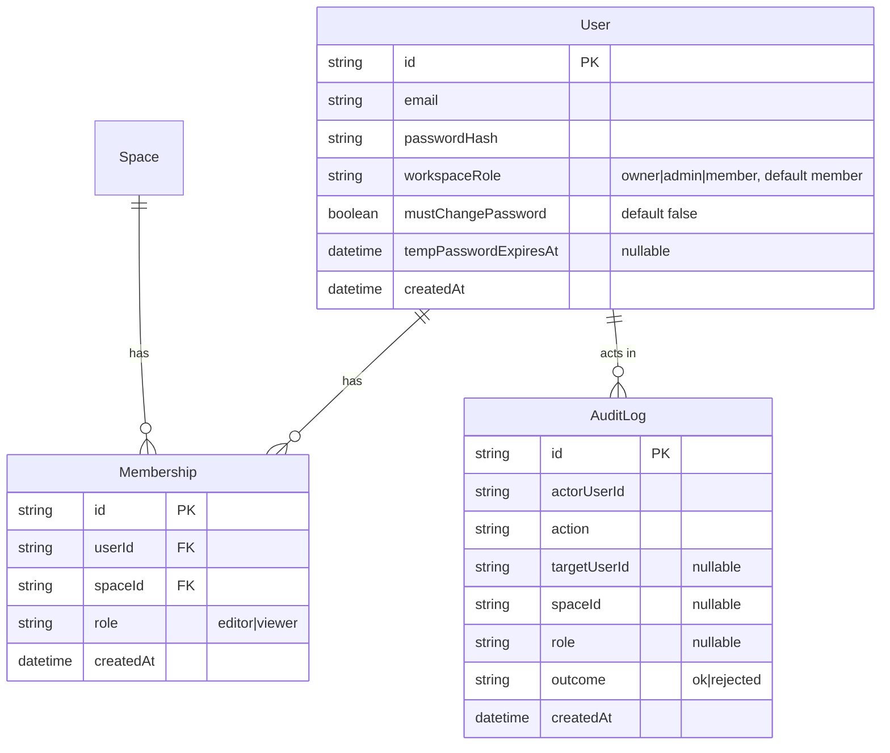
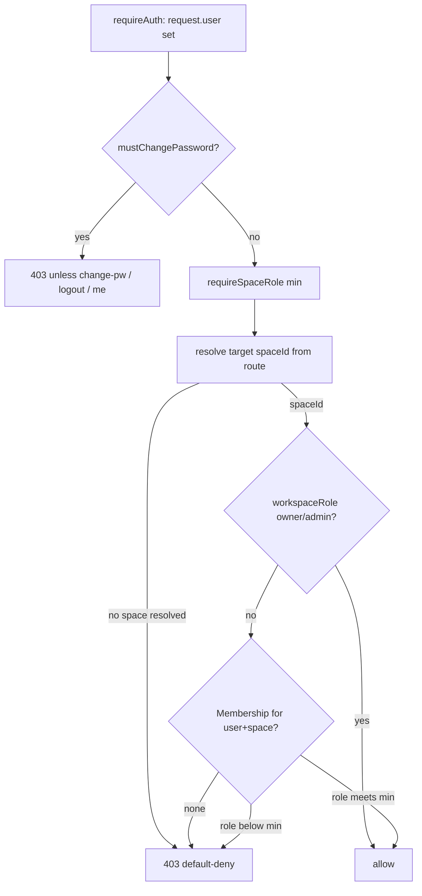

# feat: App-layer (SQLite) Per-Space RBAC

## Summary

Add per-space access control to Context Well using **app-layer enforcement only**. A two-tier role model — workspace `owner`/`admin`/`member` plus per-space `editor`/`viewer` memberships, all in SQLite — is enforced by a `requireSpaceRole` preHandler on every space-scoped route and by space-list filtering. Onboarding moves to admin-provisioned accounts with a forced first-login password change; open self-registration is removed. An admin-only Members UI manages roles, and every membership/account change is audited. This is the interim subset of the [full team-access-control plan](2026-06-26-001-feat-team-access-control-plan.md): the CyborgDB per-user token layer and all password-based key-wrapping are **deferred** and preserved on the `feat/team-access-control` branch (see origin: docs/brainstorms/2026-06-28-team-access-control-sqlite-rbac-requirements.md).

---

## Problem Frame

Context Well authenticates users but performs **no authorization** beyond a session-existence check. `requireAuth` attaches `request.user` and every `/api/*` route under the protected scope then trusts any logged-in user equally ([src/server.ts:43-50](src/server.ts#L43-L50), [src/auth/guard.ts:16-37](src/auth/guard.ts#L16-L37)). `Space` has no owner or membership ([prisma/schema.prisma:34-47](prisma/schema.prisma#L34-L47)) and `listSpaces()` returns every space ([src/spaces/service.ts:105-107](src/spaces/service.ts#L105-L107)), so "everyone sees everything" is structural. This is the gating feature before more than one person uses the app.

The full plan answers this with two enforcement layers (app checks + per-user CyborgDB tokens, with password-wrapped key custody). That crypto layer gates on flipping `cyborgdb-service` to auth-enabled — a breaking ops change — and is the bulk of the build. This plan ships **only the app layer** so access control is usable now; the crypto layer is a later follow-up on its own branch.

**Accepted interim risk:** with no per-user tokens, isolation rests entirely on `requireSpaceRole`. A space-scoped route that forgets the guard is a confidentiality bug — the exact failure mode the token layer exists to backstop. The route-guard audit (U3) is therefore load-bearing, and tests assert default-deny on every space-scoped route.

---

## Requirements

Carried from the origin requirements doc. R-IDs match origin.

- R1. First account becomes `owner` (creation screen labeled "Create root/admin user"); owner cannot be removed or demoted.
- R2. Two-tier roles: `owner`/`admin`/`member` are workspace-level; `editor`/`viewer` are per-space. No membership = no access to that space.
- R3. Only the owner may promote a user to admin or demote an admin.
- R4. Admins and the owner may grant, change, or revoke any user's per-space `editor`/`viewer` membership.
- R5. The system refuses any role change that would leave zero workspace admins; rejected attempts are audited.
- R6. Every space-scoped route checks the caller's role for the target space in addition to the session check; indirect references (a conversation/connector id belonging to another space) default-deny.
- R7. The space list returns only spaces the caller may access: all for owner/admin, member spaces for editor/viewer.
- R8. No `/api/*` response body exposes secret material (preserve `publicSpace`-style masking).
- R9. Admins create accounts with a temporary password; open self-registration (`ALLOW_REGISTRATION`) is removed and `/register` is bootstrap-only (403 once any user exists).
- R10. A user must change their temporary password on first login (a plain forced change — no token re-wrap).
- R11. An admin may reset a user's password (new temp password, forced change on next login); prior memberships/roles are unaffected.
- R12. An admin-only Members surface lists users, workspace role, and per-space roles, and supports create-account, grant/change/revoke per-space role, promote/demote admin (owner only), and password reset. Non-admins never see it.
- R13. The UI surfaces a non-blocking recommendation to name a second admin while only one exists.
- R14. Every membership/role/account change writes an audit entry (actor, action, target, space, outcome, timestamp; no secret material), including rejected invariant violations.
- R15. `/login` and admin mutation endpoints are rate-limited; temp passwords are CSPRNG-generated (≥128 bits) with a finite validity window.

---

## Role & Permission Model

| Action | owner | admin | editor | viewer | non-member |
|---|---|---|---|---|---|
| See space in list | all | all | member spaces | member spaces | — |
| Chat / query space | ✓ | ✓ | ✓ | ✓ | ✗ |
| Upload / trigger sync (ingest) | ✓ | ✓ | ✓ | ✗ | ✗ |
| Add/remove connectors, edit prompt | ✓ | ✓ | ✓ | ✗ | ✗ |
| Create / delete space | ✓ | ✓ | ✗ | ✗ | ✗ |
| Grant/revoke membership | ✓ | ✓ | ✗ | ✗ | ✗ |
| Create user accounts | ✓ | ✓ | ✗ | ✗ | ✗ |
| Promote/demote admins | ✓ | ✗ | ✗ | ✗ | ✗ |

---

## Key Technical Decisions

- **App-layer enforcement only; documented accepted risk.** `requireSpaceRole` guards plus `listSpaces` filtering deliver isolation. No CyborgDB tokens, no key-wrapping, no keyring — `src/cyborg/*` and the CyborgDB service are untouched, and `Space.indexKey` stays plaintext exactly as today. The data path is unchanged.

- **Clean schema, no crypto columns.** The additive migration adds only `User.workspaceRole`, the temp-password fields, `Membership`, and `AuditLog`. It deliberately omits the crypto design's `WrappedSecret` table, `kdfSalt`, `keyVerifier`, and `Membership.cyborgUserId` so the two designs don't bleed together (the crypto branch re-introduces them). (see origin: docs/brainstorms/2026-06-28-team-access-control-sqlite-rbac-requirements.md)

- **No data migration / backfill.** Confirmed no real users or spaces exist yet. The migration sets schema defaults only; the `owner` is established through the normal first-account bootstrap. No oldest-user→owner backfill and no per-space membership backfill routine is built.

- **Immediate revocation = session deletion.** Without a keyring to evict, a removed/demoted user is forced off by deleting their `Session` rows; their next request fails `requireAuth` and they re-login into the new role. Reuses the existing `destroySession` machinery ([src/auth/service.ts:125-130](src/auth/service.ts#L125-L130)) extended with a delete-by-user variant. An in-flight request may complete; the next one reflects the change.

- **Forced password change is server-enforced, not just UI.** A user with `mustChangePassword = true` has a valid session but a protected-scope preHandler 403s every route except change-password, logout, and `/me`. The client routes such users to a change-password screen. This keeps a temp-password holder from acting before rotating it.

- **Admins pass for every space by guard, not by membership.** `requireSpaceRole` short-circuits to allow for `owner`/`admin` workspace roles; editors/viewers are checked against their `Membership`. Isolation is among editors/viewers, never from admins — intended, mirrors the full design.

- **Default-deny with no existence oracle.** A route param resolving to no space, or to a space the caller can't access, returns the same `403` — never a `404`-vs-`403` distinction that confirms a resource in another space exists.

- **Reuse existing rate-limit and route/service conventions.** `@fastify/rate-limit` is already wired ([src/server.ts:26](src/server.ts#L26)) and applied to `/login`+`/register` ([src/auth/routes.ts:27-29](src/auth/routes.ts#L27-L29)); the same `credentialRateLimit` shape guards admin mutation endpoints. Members module follows the existing `routes.ts` + `service.ts` split and registers inside the protected scope.

---

## High-Level Technical Design

Data model (additive; existing models unchanged except `User`):

Per-request authorization for a space-scoped route (after `requireAuth` has attached `request.user`):

*Directional guidance — the gates and ordering are authoritative; helper/field names are illustrative.*

---

## Implementation Units

Dependency-ordered. Each unit is one atomic commit.

### U1. Data model — roles, memberships, audit log

- **Goal:** Additive Prisma schema for the workspace role, temp-password lifecycle fields, per-space memberships, and the audit log.
- **Requirements:** R1, R2, R14
- **Dependencies:** none
- **Files:** `prisma/schema.prisma`, `prisma/migrations/<new>/migration.sql`, `src/auth/__tests__/setup-env.ts` (ensure new columns in throwaway test DB), `src/db/__tests__/rbac-schema.test.ts`
- **Approach:** Add to `User`: `workspaceRole String @default("member")` (values `owner`|`admin`|`member`), `mustChangePassword Boolean @default(false)`, `tempPasswordExpiresAt DateTime?`. New `Membership { id, userId, spaceId, role, createdAt, @@unique([userId, spaceId]) }` with both relations `onDelete: Cascade`; `role` holds `editor`|`viewer`. New `AuditLog { id, actorUserId, action, targetUserId?, spaceId?, role?, outcome, createdAt }` — no secret columns. Keep `Space.indexKey` untouched. SQLite stores enums as strings; validate role/workspaceRole values at the application layer. Omit `WrappedSecret`, `kdfSalt`, `keyVerifier`, `cyborgUserId` (crypto-branch only).
- **Patterns to follow:** existing model + relation + `@@index` style in `prisma/schema.prisma` (e.g. `Session` at lines 24-32); tests run against the throwaway DB from `src/auth/__tests__/setup-env.ts`.
- **Test scenarios:**
  - Migration applies cleanly on an empty dev DB; existing tables preserved.
  - Constraint: duplicate `(userId, spaceId)` Membership is rejected.
  - Cascade: deleting a `Space` removes its `Membership` rows; deleting a `User` removes their `Membership` rows.
  - Defaults: a `User` created without `workspaceRole` is `member`, `mustChangePassword` is false.
  - `Test expectation:` schema + constraint tests only — behavior lives in U2-U4.
- **Verification:** `prisma migrate` succeeds; constraints and cascades hold; no change to existing data-path code.

### U2. Auth lifecycle — owner bootstrap, forced first-login change, registration lockdown

- **Goal:** Surface `workspaceRole` on the auth user, make the first account `owner`, enforce the temp-password change, and close open registration.
- **Requirements:** R1, R9, R10, R15
- **Dependencies:** U1
- **Files:** `src/auth/types.ts`, `src/auth/service.ts`, `src/auth/routes.ts`, `src/auth/guard.ts`, `src/config.ts`, `src/server.ts`, `src/auth/__tests__/auth.test.ts`
- **Approach:**
  - `AuthUser` gains `workspaceRole` and `mustChangePassword`; `toAuthUser` projects them ([src/auth/service.ts:12-14](src/auth/service.ts#L12-L14)). Never expose `passwordHash`/`tempPasswordExpiresAt`.
  - Bootstrap: when `isFirstAccount` ([src/auth/service.ts:29-32](src/auth/service.ts#L29-L32)), create the user with `workspaceRole: "owner"` and `mustChangePassword: false`.
  - `/register` ([src/auth/routes.ts:75-100](src/auth/routes.ts#L75-L100)) returns `403` whenever a user already exists, independent of any config flag; retire `config.allowRegistration` / `ALLOW_REGISTRATION` ([src/config.ts:29,40](src/config.ts#L29-L40)).
  - New `POST /api/auth/change-password` (authenticated): verifies current/temp password, sets new hash, clears `mustChangePassword` and `tempPasswordExpiresAt`. Reuse argon2 verify/hash.
  - Login: reject when `tempPasswordExpiresAt` is set and in the past (temp password expired → must be reset by an admin), with a generic message (no enumeration).
  - Add a protected-scope preHandler (in `guard.ts`, installed in `src/server.ts:43-50`) that, when `request.user.mustChangePassword`, 403s every route except `change-password`, `logout`, and `/me`.
- **Execution note:** Add a failing test for "first account is owner" and "second registration is 403" before implementing.
- **Patterns to follow:** existing `credentialRateLimit` and route handlers in `src/auth/routes.ts`; `toAuthUser` strip discipline; `validateSession` opportunistic-expiry style.
- **Test scenarios:**
  - `Covers R1.` first registered account has `workspaceRole = owner`; a second `POST /register` returns 403 regardless of env.
  - Happy: `/me` returns `workspaceRole` and `mustChangePassword`.
  - `Covers R10.` a user with `mustChangePassword` gets 403 on a space route but can call change-password; after changing, the flag clears and routes work.
  - Edge: login with an expired temp password fails with a generic error; login with a valid temp password succeeds but flags `mustChangePassword`.
  - Edge: change-password with wrong current password fails; password is unchanged.
  - Security: no auth response includes `passwordHash` or `tempPasswordExpiresAt`.
- **Verification:** Bootstrap yields an owner; registration is bootstrap-only server-side; temp-password holders cannot act before rotating.

### U3. Authorization layer — `requireSpaceRole` guard + space-list filtering

- **Goal:** A reusable per-space role guard applied to every space-scoped route, plus `listSpaces` filtering and a workspace-role guard for admin-only routes.
- **Requirements:** R6, R7, R8
- **Dependencies:** U1
- **Files:** `src/auth/space-guard.ts` (new), `src/auth/__tests__/space-guard.test.ts` (new), `src/spaces/routes.ts`, `src/spaces/service.ts`, `src/chat/routes.ts`, `src/uploads/routes.ts`, `src/connectors/routes.ts`
- **Approach:** `requireSpaceRole(min: "viewer" | "editor")` returns a preHandler that resolves the target `spaceId` from the route — `:id` for spaces/uploads ([src/spaces/routes.ts:53-99](src/spaces/routes.ts#L53), [src/uploads/routes.ts:41](src/uploads/routes.ts#L41)), `connector.spaceId` for `/connectors/:id/*` ([src/connectors/routes.ts:127-189](src/connectors/routes.ts#L127)), `conversation.spaceId` for chat/conversation routes ([src/chat/routes.ts:41](src/chat/routes.ts#L41), [src/spaces/routes.ts:112](src/spaces/routes.ts#L112)) — loads the caller's `Membership`, short-circuits allow for `owner`/`admin`, and 403s on missing space, no membership, or insufficient role (default-deny, same 403 for all). Apply after the existing existence lookup on each handler. Add `requireWorkspaceRole("admin")` in the same module for U4. `listSpaces` ([src/spaces/service.ts:105-107](src/spaces/service.ts#L105-L107)) filters to the caller's memberships, returning all for owner/admin. Audit every handler in the four route files so none stays on the bare session check; map create/delete-space and connector/prompt mutations to the `editor`/admin minimums per the permission table.
- **Patterns to follow:** `requireAuth` preHandler shape and `reply.code(403).send({error})` convention in [src/auth/guard.ts:16-37](src/auth/guard.ts#L16-L37); existing `getSpace`/`getConnector` existence lookups.
- **Test scenarios:**
  - `Covers AE1.` editor of Space A, non-member of Space B: B absent from `GET /api/spaces`; direct calls to B's document/connector/chat/upload routes return 403.
  - Happy: viewer can chat/read a member space; editor can upload, edit prompt, and manage connectors; only owner/admin can create/delete a space.
  - `Covers AE2.` an upload/sync/connector-mutation by a viewer is 403'd at the guard.
  - `Covers AE5.` a viewer of A requesting a conversation or connector belonging to B by id → 403 (default-deny), not a leak; the 403 is indistinguishable from "resource does not exist."
  - Edge: a route param resolving to no space (deleted conversation, bad connector id) → 403, not pass-through.
  - Edge: owner and admin pass for every space without an explicit membership.
  - Edge: creating a connector/conversation under a space authorizes the target `spaceId` from the route, not from an unchecked body field.
  - Security: a space-list / connector / conversation response body contains no `indexKey` or other secret (boundary scan).
- **Verification:** No space-scoped route is reachable without the correct role; indirect references default-deny; the space list reflects membership.

### U4. Members & account management service + routes

- **Goal:** Admin-guarded service and routes for account creation, role grant/change/revoke, admin promote/demote, password reset, the last-admin invariant, audit logging, and immediate session teardown.
- **Requirements:** R3, R4, R5, R9, R11, R14, R15
- **Dependencies:** U1, U2, U3
- **Files:** `src/members/service.ts` (new), `src/members/routes.ts` (new), `src/members/__tests__/service.test.ts` (new), `src/auth/service.ts` (add `dropSessionsForUser`), `src/server.ts` (register in protected scope)
- **Approach:** Routes registered in the protected scope, guarded by `requireWorkspaceRole("admin")` and the `credentialRateLimit` shape.
  - **Create account:** user row + `workspaceRole: "member"` + CSPRNG temp password (≥128 bits via `crypto.randomBytes`) hashed with argon2 + `mustChangePassword: true` + `tempPasswordExpiresAt`. No session created (no auto-login). Returns the temp password once to the admin for out-of-band handoff.
  - **Grant / change role:** upsert `Membership(userId, spaceId, role)`; on a change that lowers/alters access, drop the target's sessions.
  - **Revoke / remove member:** delete the `Membership`, then `dropSessionsForUser(targetUserId)`.
  - **Promote admin** (owner only): set `workspaceRole: "admin"`. **Demote** (owner only): set `workspaceRole: "member"` + drop sessions.
  - **Password reset** (admin): set a new CSPRNG temp password + `mustChangePassword: true` + new expiry; drop the target's sessions. Memberships untouched.
  - **Invariants:** reject any demote/remove that would leave zero `owner`/`admin` users; the owner cannot be demoted or removed. Rejections return a clear error and write a `rejected` audit entry.
  - **Audit:** every action (and every rejected invariant) writes an `AuditLog` row.
  - `dropSessionsForUser` in `src/auth/service.ts` deletes all `Session` rows for a user (extends [src/auth/service.ts:125-130](src/auth/service.ts#L125-L130)).
- **Execution note:** Add failing tests for the last-admin invariant and the owner-immutability rule before implementing.
- **Patterns to follow:** domain `routes.ts` + `service.ts` split (e.g. `src/spaces/`); `credentialRateLimit` from `src/auth/routes.ts`; protected-scope registration in `src/server.ts:43-50`.
- **Test scenarios:**
  - `Covers AE3.` remove a member: membership gone, target's sessions dropped, an audit entry written; the user's next request 401s and they no longer see the space.
  - `Covers AE4.` demote editor→viewer: the `Membership.role` becomes `viewer`, sessions dropped; after re-login they can chat but an upload is 403'd.
  - Happy: admin creates an account (CSPRNG temp pw, no auto-login, `mustChangePassword` set); grant assigns a role; an audit row exists for each.
  - `Covers R5.` system refuses to demote/remove the last admin and refuses to demote the owner, each returning an error and writing a `rejected` audit entry.
  - Edge: only the owner can promote/demote; an admin attempting it is 403'd.
  - Edge: password reset sets a new temp password and forces change; the user's old password no longer logs in; memberships are preserved.
  - Security: members mutation endpoints are rate-limited; a non-admin calling any members route is 403'd; no response body returns a password hash (the one-time temp password is the only secret returned, by design, to the creating admin).
- **Verification:** Every management action keeps the DB consistent and audited; invariants hold; revocation/demotion takes effect on the target's next request.

### U5. Members UI & onboarding screens

- **Goal:** Admin-only Members view, relabeled first-account screen, removed register toggle, forced password-change screen, and the second-admin nudge.
- **Requirements:** R1, R12, R13
- **Dependencies:** U3, U4
- **Files:** `public/index.html`, `public/support.js`
- **Approach:** Add a `view: 'members'` (admin/owner only, gated on `workspaceRole` from `/api/auth/me`) mirroring the existing `goChat`/`goSources` view-switching ([public/index.html:824+](public/index.html#L824)), with a users × per-space-roles table whose actions call the U4 endpoints via the existing `apiJson` helper ([public/index.html:722-735](public/index.html#L722-L735)). Relabel the first-account screen "Create root/admin user" (R1). Remove the login/register toggle in `submitAuth` so the auth screen is login-only once bootstrapped ([public/index.html:757-778](public/index.html#L757-L778)). Add a forced change-password screen shown when `/me` reports `mustChangePassword`, blocking the app until the change succeeds. Show a dismissible banner recommending a second admin while only one `owner`/`admin` exists. Never render secret material.
- **Patterns to follow:** existing view-switching and table markup in `public/index.html`; `apiJson` calls; the `bootstrap()`/`/me`-driven stage routing ([public/index.html:738-750](public/index.html#L738-L750)).
- **Test scenarios:**
  - `Test expectation:` UI wiring — covered by the route/service tests in U3/U4 plus a manual walkthrough; no new behavioral logic beyond view gating and the forced-change redirect.
  - Edge: a non-admin never sees the Members view (gated on `workspaceRole`).
  - Edge: a user with `mustChangePassword` lands on the change-password screen and cannot reach chat/sources until it succeeds.
- **Verification:** Admins manage members from the UI; non-admins cannot see it; onboarding screens reflect the new model.

---

## Scope Boundaries

### Deferred to Follow-Up Work (the crypto branch, `feat/team-access-control`)
- CyborgDB per-user `cdbk_` tokens and database-level read/write enforcement.
- `cyborgdb-service` auth-enabled flip + configured root key.
- Password-derived key-wrapping (KDF/AEAD), app master key, root-key & index-key envelopes, in-session keyring.
- Index-key envelope cutover migration; token-revocation-first deletion ordering and the reconcile backstop.

### Deferred for later (from origin)
- Email invites / email sending; self-service password reset; two-factor authentication; agent service accounts / non-human tokens.

### Outside this product's identity (from origin)
- SSO / external identity providers; multi-workspace / org tenancy; per-space admins that don't sit in the workspace tier.

---

## System-Wide Impact

- **Auth boundary:** introduces the app's first authorization layer; every space-scoped route changes from any-session to role-gated. A missed route is a confidentiality bug — U3's audit across the four route files is load-bearing, and the accepted interim risk is that nothing below the app backstops it.
- **Onboarding:** open registration is removed; accounts are admin-provisioned. Operators must create the first (owner) account, then provision others. `ALLOW_REGISTRATION` is retired.
- **Sessions:** role removal/demotion/reset deletes the target's sessions, forcing re-login — acceptable and immediate.
- **Data path unchanged:** `src/cyborg/*`, the CyborgDB service, and `Space.indexKey` are untouched; no re-ingest or re-key.

---

## Risks & Dependencies

- **Guard-coverage completeness.** Because enforcement is app-only, a space-scoped route without `requireSpaceRole` silently leaks. Mitigation: U3 audits all four route files; tests assert default-deny per route including IDOR cases.
- **Forced-change bypass.** If the `mustChangePassword` preHandler misses a route, a temp-password holder could act. Mitigation: implement it as a scope-level preHandler with an explicit allow-list (change-password, logout, `/me`), tested in U2.
- **Last-admin lockout.** A bug in the invariant could leave zero admins (unrecoverable member management). Mitigation: failing tests for the invariant before implementation (U4).
- **Branch independence.** This branch (`feat/rbac-sqlite`) must not depend on the crypto code on `feat/team-access-control`; it is based at the pre-crypto docs commit and touches none of the wrapped-secret/keyring/token modules.

---

## Sources / Research

- Origin requirements: docs/brainstorms/2026-06-28-team-access-control-sqlite-rbac-requirements.md.
- Superset plan this carves down: [2026-06-26-001-feat-team-access-control-plan.md](2026-06-26-001-feat-team-access-control-plan.md) — app-layer units U3/U8/U9/U11 retained here as U1/U3/U4/U5; crypto units U1/U2/U4/U5/U6/U7/U10/U12 deferred.
- Current-state grounding (verified against the `feat/rbac-sqlite` baseline): auth guard & protected scope [src/auth/guard.ts:16-47](src/auth/guard.ts#L16-L47), [src/server.ts:43-50](src/server.ts#L43-L50); session lifecycle [src/auth/service.ts:78-130](src/auth/service.ts#L78-L130); registration gate [src/auth/routes.ts:75-100](src/auth/routes.ts#L75-L100), [src/config.ts:29-40](src/config.ts#L29-L40); unfiltered space list [src/spaces/service.ts:105-107](src/spaces/service.ts#L105-L107); space-scoped routes [src/spaces/routes.ts](src/spaces/routes.ts), [src/chat/routes.ts:41](src/chat/routes.ts#L41), [src/uploads/routes.ts:41](src/uploads/routes.ts#L41), [src/connectors/routes.ts:84-189](src/connectors/routes.ts#L84-L189); data model [prisma/schema.prisma:16-47](prisma/schema.prisma#L16-L47); rate limit [src/server.ts:26](src/server.ts#L26), [src/auth/routes.ts:27-29](src/auth/routes.ts#L27-L29); UI [public/index.html:722-784](public/index.html#L722-L784).
</content>
